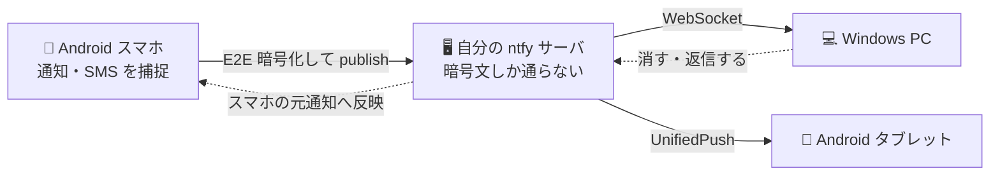

# Peranta

[](https://github.com/xia-sava/peranta/actions/workflows/release.yml)
[](LICENSE)

Android スマホに届いた通知と SMS を、**自分で立てたサーバだけを通して**手元の Windows PC や
Android タブレットへ転送する。ワンタイムコードを打ち込むために毎回スマホを取りに行く、を無くすのが目的。

Kotlin Multiplatform + Compose Multiplatform で Android と Windows Desktop を共通実装している。

> [!NOTE]
> このリポジトリのコードはほぼ全て [Claude Code](https://claude.com/claude-code) が書いている。
> 設計判断と実機での動作確認は人間が行っているが、実装の一行一行まで人間が検証したものではない。

## 特徴

- **中継は自分の ntfy サーバだけ**。Google / Apple のプッシュ基盤を経由しない
- **E2E 暗号化が必須**（AES-GCM 256bit）。サーバに置かれるのは暗号文だけで、鍵は端末しか持たない
- **受信側から操作できる**。PC のトーストから「通知を消す」「返信する」「通知のアクションを実行する」が
  そのまま行え、スマホ側の元通知にも反映される
- **既読同期**。どこかの端末で消せば、全端末とスマホの元通知がまとめて消える
- **画像とファイルの転送**。通知に付いた画像は自動で、任意のファイルは手動で送れる
- **アプリ内から自己更新**できる

## 仕組み



端末どうしは直接つながらず、すべて自分の ntfy サーバを介する。サーバは暗号文を素通しするだけで、
本文を復号する鍵を持たない。

## 動作環境

| 役割 | 要件 |
|------|------|
| 送信（通知の取得元） | Android 11 以降 |
| 受信 | Windows 10/11、または Android 11 以降 |
| サーバ | Docker の動く Linux 1 台 + ドメイン |

Android での受信には UnifiedPush ディストリビュータとして
[ntfy アプリ](https://f-droid.org/packages/io.heckel.ntfy/) が必要。

## インストール

[Releases](https://github.com/xia-sava/peranta/releases/latest) から取得する。

- **Windows**: `peranta.msi`
- **Android**: `peranta.apk`

Play ストアには出していないため、Android では初回インストール時に Play プロテクトの警告が出る。
ダイアログ末尾の「インストールする」から進める。

インストール後の更新はアプリ内で完結する（設定画面 →「アプリの更新」）。

## 使いはじめる

1. **ntfy サーバを立てる** — [`server/README.md`](server/README.md)。設定と Docker Compose
   一式が入っていて、ドメインを向ければ数コマンドで動く
2. **端末を設定する** — [`docs/setup.md`](docs/setup.md)。1 台目で共有鍵を作り、QR で他の端末へ配る

### 公式ホスト（ntfy.sh）を使う場合

サーバを立てずに [ntfy.sh](https://ntfy.sh) を指定しても動く。トピック名には 16 文字の
ランダム文字列が入るため第三者に見つけられる危険性は低く、本文は E2E 暗号化されているので
サーバの運用者にも読めない。仮に誰かが同じトピックへ書き込んでも、鍵を持たない以上
復号に失敗して弾かれる。

ただし次の制約がある。

- **添付が実用にならない**。無料枠のファイルサイズ上限と保持期間は Peranta の想定
  （1 ファイル 350MB / 72 時間）よりずっと小さい。通知画像の自動添付、ファイル送信、
  長文の全文表示はいずれも添付を使う
- **メッセージサイズの上限**。ntfy の既定は 4KB で、Peranta は自前サーバでこれを 16KB へ
  引き上げている。本文の長い通知やアクション付きの通知は上限に触れることがある
- **レート制限**。通知の多い端末では無料枠の上限に達しうる
- **メタデータは残る**。本文は読めなくとも、いつどれだけ通知が流れたかはサーバ側に見える

試すには手軽なので、まず動かしてみて、常用するなら自前サーバへ移すのがよい。
ホスト名を変えるだけで移行できる（共有鍵とトピック名は QR で配り直す）。

## ビルド

JDK 23 が必要。

```sh
# 全テスト + カバレッジ検証
./gradlew check

# Windows インストーラ（WiX 3 が要る）
./gradlew :desktopApp:packageMsi

# Android
./gradlew :androidApp:assembleRelease
```

Desktop を開発実行するときは `-Dperanta.devMode=true` を付けると、平文 HTTP のローカルサーバへ
接続でき、環境変数（`PERANTA_*`）での設定上書きも効く。リリースビルドでは TLS が強制される。

```sh
./gradlew :desktopApp:run
```

## リポジトリ構成

```
shared/      共有ロジックと UI（データモデル・暗号・ntfy 送受信・Compose 画面）
androidApp/  Android エントリポイント（送信・受信の両方）
desktopApp/  Windows Desktop エントリポイント（受信）
server/      ntfy サーバの設定と Docker Compose
docs/        セットアップ手順
tools/icons/ アイコンの意匠と生成スクリプト
```

## ライセンス

[MIT License](LICENSE)
