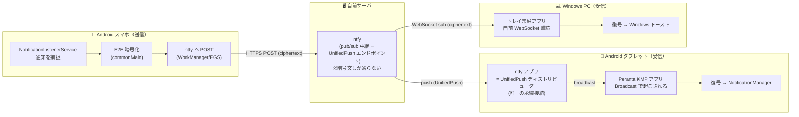

# Peranta 設計仕様

通知転送アプリ（Pushbullet 後継の自作版）の設計仕様。実装と食い違いが出た場合はこの文書を正とし、
仕様を変える判断をしたときはここへ反映する。

---

## 0. 名前

**Peranta**（ペランタ）

- エスペラント語 `peri`（仲介する）+ `-ant-`（現在能動分詞）+ `-a`（形容詞語尾）＝「仲介している」。
- 通知を端末間で中継するというアプリの機能そのものを表す。
- パッケージ名: `to.sava.peranta`
- 被りチェック済み（2026-07-08）:
  - [loque/peranta](https://github.com/loque/peranta) — JavaScript の IPC ライブラリ。分野が全く異なり実害なし。
  - 通知・push 関連の製品/サービスでの使用例は見当たらず。商標レベルでも有名どころとの衝突なし。

---

## 1. ゴールと非ゴール

### ゴール

- Android スマホに来た通知（最低限 OTP / ワンタイムコード）を、他の端末（Windows PC / Android タブレット）で見られる。
- **受信端末が寝ていても、多少のラグを許容しつつ叩き起こして通知を出す**。
- 中継インフラは**自前ホスト（自分の ntfy サーバ）**で完結。Google / Apple のプッシュ基盤に依存しない。
- Android と Desktop のコードを **Kotlin Multiplatform (KMP) で最大限共有**する（半分趣味プロジェクト）。

### 非ゴール（現時点）

- iOS 受信対応（iOS は APNs 強制で脱 Google/Apple が崩れるため、当面対象外）。
- Desktop の macOS 対応（Windows 専用でよい。Windows 固有のネイティブ連携を躊躇なく使う）。
- クリップボード同期・自由文メッセージングなど Pushbullet 相当のフル機能の一部（ペイロードの `type` 設計に拡張余地だけ残す。§4）。
- 瞬時（sub-second）配信保証（「多少のラグ許容」が前提）。

画像/ファイル転送（通知に付く画像、任意ファイルの送受信）もスコープに含む（§4.3）。

---

## 2. 全体アーキテクチャ



### 設計の肝：「自分のアプリは接続を持たない、システム側の常駐者に叩き起こしてもらう」

| 経路 | 起こされ方 | 永続接続を持つのは誰か |
|------|-----------|----------------------|
| 通知捕捉（Android） | OS の `NotificationListenerService` コールバック（イベント駆動） | OS がサービスを bind 保持 |
| 受信（Android） | UnifiedPush（ntfy ディストリビュータの broadcast） | **ntfy アプリ**が 1 本だけ |
| 受信（Desktop） | トレイ常駐アプリが自前で購読 | アプリ自身（Desktop に Doze なし） |

→ Peranta 本体は送受信とも**完全にイベント駆動**で組める。起きっぱなしの常駐者は「Android の ntfy ディストリビュータ」と「Desktop のトレイ常駐ソケット」だけ。

全端末が送信機能（コマンド返送・将来のメッセージ/ファイル送信、§3.4）を持ち、役割を問わず逆方向コマンドの受け口として UnifiedPush エンドポイントを登録する。「通知を送信する」設定は、この端末に届いた通知・SMS を自動転送するかどうかの ON/OFF に過ぎない。通常の運用ではスマホだけこれを ON にするが、これは運用上の一例であって制約ではない。

### プラットフォーム差の宣言（PlatformCapabilities）

Android と Desktop の機能差は、ロール名やプラットフォーム名での分岐ではなく、`PlatformCapabilities`
（expect/actual）が宣言する能力フラグで表す: 通知捕捉（NLS）の可否・SMS 直接受信の可否・受信経路
（UnifiedPush か WebSocket 直購読か）・POST_NOTIFICATIONS 権限の要否・自動起動対応の有無。
ウィザード（§10.7）や設定画面の項目出し分けはこの capability を参照して行い、プラットフォーム名で
分岐を書かない。現在の宣言値は、Android が通知捕捉・SMS 受信・UnifiedPush・POST_NOTIFICATIONS 要が
true で自動起動が false、Desktop はその逆（自動起動のみ true）。

---

## 3. データフロー（詳細）

### 3.1 送信（Android スマホ）

1. ユーザーが「通知へのアクセス」権限を付与 → OS が `NotificationListenerService` を bind して保持。
2. 任意アプリが通知を post → OS が `onNotificationPosted(sbn)` を発火（アプリ UI が死んでいても・Doze 中でも発火し、短い実行枠が与えられる）。
3. フィルタで対象通知（OTP 等）を選別。
4. ペイロード（送信元アプリ名・タイトル・本文など）を **commonMain の暗号化ロジックで暗号化**。
5. go-ntfy の自分トピックへ HTTPS POST。送信の確実化は優先度で分岐する:

```text
onNotificationPosted()
  ↓
if OTP など高優先:
    即時 HTTPS POST を試行
    失敗したら WorkManager expedited job / 短命 FGS で再送キューへ
else:
    通常の background 送信キューへ
```

- **仕事用プロファイル（自ユーザーとは別のプロファイル）で発生した通知は、既定では転送しない。**
  転送するかどうかの判断は、パッケージ名（§7）だけでなく通知の発生プロファイルも軸に持つ。組織の管理境界の
  内側にある通知が、利用者の意図と無関係に境界の外へ出ることを防ぐため。個人プロファイルの
  `PackageManager` からは別プロファイルのアプリを引けず、パッケージ名によるフィルタが意図どおり効くとは
  限らないので、この判断はフィルタに委ねずプロファイルそのもので行う。設定「仕事用プロファイルの通知も
  転送する」（§11）を ON にしたときだけ、個人プロファイルと同じ扱いになる。個人プロファイルの通知は
  この設定に影響されない。
- 深い Doze 下でのネットワーク制限対策として、キュー経路は WorkManager を基本とする。
- 再送の即時性は WorkManager expedited を第一候補とし、実測（実機の Doze 下）で許容（分単位）を超える場合のみ短命 FGS に切り替える。送信キューは切り替え可能な構造にしておく。
- OEM のバッテリーキラー機種では bind が切られることがあるので、バッテリー最適化除外 ＋ `requestRebind` で復帰する保険を入れる。
- ペイロードの本文は**バイト基準**で切り詰める。暗号文 Envelope が ntfy の message-size-limit（既定 4096 bytes）に収まるよう、平文合計を約 2600 bytes 以下に抑える（base64 4/3 膨張 + タグ/nonce/JSON オーバーヘッドを見込む）。文字数基準だと CJK で超過するため不可。切り詰めはサロゲートペア（絵文字）を分断しない。
- 再送キュー（WorkManager）には暗号文 Envelope に加え、ローカルタイムライン記録用の最小表示メタ（appName・§11 で伏せ字適用後の title、**本文は含めない**）を載せる。再送成功時にこのメタで SentNotification を記録する。ワイヤに出るのは暗号文のみで、このメタは端末内 WorkManager DB に閉じる。

#### コンパニオン機器としての登録（Android 15 以降）

Android 15 以降は、端末上の分類器が「機微」と判定した通知の本文が、信頼されていない
`NotificationListenerService` へ渡らない（本文を伏せた公開版に差し替えられる）。判定は通知ごとで、
画面のロック状態とは無関係。伏せられた通知はタイトルが空・本文が定型文・アクションのラベルも空になる。

- **信頼の条件**: `RECEIVE_SENSITIVE_NOTIFICATIONS`（一般アプリには付与されない）を持つか、
  `CompanionDeviceManager` の関連付けが 1 件以上あるか。後者は追加権限なしで作れるため、こちらを使う。
- **関連付けの作り方**: 機器の種別フィルタもプロファイルも指定せずに `associate()` を呼び、システムの
  一覧からユーザーに選ばせる。プロファイル指定（`DEVICE_PROFILE_COMPUTER` 等）と、機器を探さずに
  登録できる self-managed はいずれも特権が要るため使えない。マニフェストに
  `uses-feature android.software.companion_device_setup` の宣言が要る（無いと `associate()` が例外になる）。
- **登録後は通知リスナーを張り直す**。信頼済みかの判定は bind 時に効くため、`requestRebind()` を呼ばないと
  次に OS が bind し直すまで伏せ字のままになる。
- 未登録でも大半の通知は本文まで転送できるため、セットアップでは必須にせず、動作チェックでは情報として扱う。
- 伏せ字のまま届いた通知は、SMS の重複抑止（内容の一致で見る）をすり抜けて二重に転送される。
  登録するとこの症状も併せて消える。

#### SMS の直接受信（送信側の第 2 経路）

SMS（特に OTP）は NLS 経由とは別に、`RECEIVE_SMS` broadcast で直接受信する経路を設け、こちらをデフォルトとする。

- NLS 経由の弱点: SMS アプリの通知スタイルに依存する（本文省略・グループ化・ロック画面設定次第で内容が取れない、既読なら通知自体が出ない）。
- 直接受信なら本文全文が確実に取れ、使用中の SMS アプリに依存しない。
- 個人用サイドロード配布のため、Play ストアの `RECEIVE_SMS` 使用制限は受けない。
- 同一 SMS が NLS 経由でも拾われた場合の重複転送は抑止する。
- 転送済み通知と同一内容のままの再投稿（メッセージアプリが新着のたびに未読会話の通知を再掲する等）は、元通知が消えるまで転送を抑止する。元通知が削除されたら記録を忘れ、後日の同一内容の正当な再表示（定時リマインダー等）は再び転送する。
- ペイロード type は `sms`（§4）。

直接受信した SMS には、転送する時点では対応する通知が存在しない（SMS アプリが通知を出すのは
broadcast より少し後）。そこで本文だけを先に転送し、**SMS アプリの通知を重複として落とした時点で
対応関係が判明する**ので、その通知の key を載せた改版を追って送る（§4.3.1 と同じ `revision` による
二段配送）。これにより SMS アイテムでも既読同期（§3.4）が効くようになる。

重複判定の記憶（既定 60 秒）を過ぎてから通知が出た場合は対応づけを取り逃がす。本文の転送自体は
済んでいるため、その SMS は既読同期が効かない（受信端末ローカルの非表示のみ）状態に留まる。

### 3.2 受信（Android タブレット・UnifiedPush 経由）

1. Peranta が UnifiedPush ライブラリで**ディストリビュータ（ntfy アプリ）に登録** → **エンドポイント URL（＝ntfy のトピック URL）が払い出される**。
2. ディストリビュータ（ntfy）が go-ntfy に**単一の永続接続**を維持（instant delivery = 自身が foreground service + WebSocket keepalive。ユーザーが ntfy をバッテリー最適化から除外すればほぼ確実。除外しなければポーリングにフォールバック＝ラグ増）。
3. サーバにメッセージ到達 → ディストリビュータが **broadcast Intent** で Peranta を起こす（Doze 中でも一瞬起こされる）。
4. `BroadcastReceiver.onReceive()` で**復号 → `NotificationManager` で通知表示**。表示だけならこの受信枠で足りる。長い処理が要れば FGS/WorkManager に繋ぐ。
5. 本文（通知は title + text、SMS は text）から URL が抽出できたときは、通知に ACTION_VIEW の「開く」
   アクションを 1 個付ける。押すと受信端末のローカル操作として既定ブラウザで先頭 URL を開く
   （コマンドは送らない）。
6. 通知本体（「開く」ボタンではなく通知全体）をタップするとアプリを起動し、タイムラインの該当
   アイテムまでスクロールする（表示リストに無ければスクロールせず起動のみ）。設定など別の画面を
   開いたままでも、タイムラインへ移してから受ける（開いていた画面のまま前面に出ると、タップの
   目的である該当アイテムに辿り着けない）。この遷移は他の導線と同じ経路を通し、設定を離れるときの
   設定反映（§10.2）を伴う。Desktop のトーストのクリック（§3.3）も同じ。
7. 通知には**発信元**（転送元の端末名と、その端末で通知を出したアプリ名）を添える。タイトルの
   意味はアプリによって異なり（送信者名を入れるアプリが多い）、タイトルだけでは何の通知か判らない
   ため。直接受信した SMS は元のアプリが無いのでアプリ名の位置に「SMS」を置く。受信メッセージは
   タイトルが送信元の端末名なので添えない。Android は `setSubText` で通知ヘッダに出す。
8. 通知へ渡る文字列は受信の関門で正規化済みのものを使う（§4.4）。発信元とタイトル・本文の境界を
   改行や不可視文字で曖昧にされないよう、表示面ごとに手当てせず 1 箇所で当てる。
9. ミラー通知は**元通知のロック画面可視性（§4.1 の `visibility`）に従う**。伏せる指定のときは
   ロック画面で本文を出さず、代わりに発信元だけを載せた通知を添える。隠す指定のときはロック画面に
   出さない。可視性を運んでいない（旧バージョン由来の）通知と、元通知を持たない SMS・受信メッセージは
   伏せる側として扱う。これは `visibility` を指定しない通知に Android が当てる既定と同じ扱いで、
   受信端末の見え方はそのままである。

> **代替案 (b)**: UnifiedPush を使わず、Peranta 自身が foreground service で go-ntfy を直接購読する構成も可能。ntfy アプリの同居が不要になる代わりに、Doze / OEM バッテリーキラーとの戦いを自アプリで抱える。据え置きタブレット＋ラグ許容なら成立するが、**(a) UnifiedPush を採用**（寝起きの確実さを枯れた仕組みに委譲できる）。(b) は将来のフォールバックオプションとして設計だけ残す。

### 3.3 受信（Windows Desktop）

1. トレイ常駐アプリ（Compose for Desktop / JVM）が起動時から go-ntfy を **WebSocket 購読**（Doze も UnifiedPush も無い世界なので自前ソケットで十分）。
2. メッセージ到達 → **復号 → トースト表示**。アクションボタン付きの本式な通知を v1 から出す。
   - クリックでアプリのタイムラインを開き、元アイテムまでスクロールする（表示リストに無ければ前面化のみ）。「送信元の通知を消す」ボタンでアプリを開かずに既読同期（§3.4）を発火する。
   - 受信ファイル・受信メッセージ・エラーのトーストもクリックで同様に前面化＋該当アイテムへスクロールする。これらの「送信元の通知を消す」押下は送るべき既読同期コマンドを持たないため何もしない。
   - 本文（title + text）から URL が抽出できたときは「開く」ボタンを追加した 2 ボタン構成にする。「開く」押下時は既定ブラウザで先頭 URL を開く（受信端末のローカル操作のみで、コマンドは送らない）。URL が無い通知は「送信元の通知を消す」の 1 ボタン構成にする。
   - **トーストは OS の通知機能に委ねず、Compose のウィンドウとして自前で描く**。1 トーストが 1 ウィンドウで、枠なし・透過・常に最前面・フォーカスを奪わない設定で画面右下に出す。内容の高さに合わせてウィンドウが伸び、先に出たものが下に残って新しいものが上へ積み上がる。同時表示は 8 件までとし、超えた分は表示しない。
   - 高さは**表示中に内容が伸びたときも追随する**。後から届いた画像・送信者アイコン（§4.3.1）で差し替わると内容が高くなるため、ウィンドウが元の高さのままだと下端のボタンが残り高さを失って潰れる。内容はウィンドウの高さを制約とせずに測り、その結果をウィンドウへ反映する。伸びた分は積み上げの位置計算にも波及し、上に載っているトーストが押し上がる。
   - 本文は 4 行、件名は 2 行までで打ち切る。全文を載せてくる送信元（メールなど）でトーストが画面を占有しないようにする。画像も高さの上限で抑える。この打ち切りは表示上の都合で、外部入力に対する防御は受信の関門（§4.4）が担う。件名や発信元に改行や不可視文字を混ぜて 4 行の中で別の通知に見せかける手口は、関門の正規化で成立しない。
   - トーストは自動では消えず、操作するまで画面に残す。取り下げは × ボタン・左右へのスワイプ（幅の 2 割まで動かすか、浅くても速く払う）・「送信元の通知を消す」ボタンのいずれか。スワイプはウィンドウごと動かすため、移動量はウィンドウ内の相対座標ではなく画面上のマウス位置から測る。
   - × とスワイプは**この端末の表示を引っ込めるだけ**でコマンドを送らない。スマホ側に通知を残したまま PC の画面だけ片づける使い方（手元で処理する用事のリマインダー等、スマホの通知が残っていること自体に意味がある通知）を支えるため、「送信元の通知を消す」との違いは意図した仕様として維持する。この区別はジェスチャの意味で決まり、アイテムの種類には依らない。
   - ヘッダ行にはアプリ名「Peranta」を出し、発信元（§3.2 と同じ組み立て）が判ればそれを続けて並べる。
   - 配色は Windows のトーストに寄せ、OS のライト / ダーク設定に追従する。
   - 表示に合わせて **Windows のサウンド設定に登録された通知音**（`HKCU\AppEvents\Schemes\Apps\.Default\Notification.Default\.Current`）を鳴らす。ユーザーが音を割り当てていなければ鳴らさない。
   - 自前描画のため、トーストは Windows の通知履歴（アクションセンター）には残らず、集中モードにも従わない。見逃した通知はアプリのタイムラインで拾う。
   - 同じ理由でトーストは Windows のロック画面にも出ない（ロック中は別のデスクトップが前面に来る）。元通知のロック画面可視性（§4.1）はロック画面での見え方を決める指定なので、トーストの表示には当てない。ロックせず放置された画面から読まれることは、画面ロックの運用で防ぐ。
   - 表示中のトーストは id を指定して取り下げられる。既読同期で他端末から消された通知を受信端末側でも消すのに使う（§3.4）。同じ通知の再投稿で同一 id が複数並ぶことがあるため、一致するものは全件取り下げる。
3. OS 起動時オートスタート登録。設定画面の「この PC での動作」から登録・解除する（§10.2）。
   - 登録コマンドには常にトレイ常駐で始める起動引数を付ける。ログオン時にウィンドウを開く選択肢は設けない
     （サインインのたびにウィンドウが出ても邪魔になるだけのため）。この挙動は設定画面の説明文で明示する。
   - 実行ファイルのパスは jpackage の `jpackage.app-path` から取り、§12 と同じ検証（実在する実行ファイルで、
     その置き場の配下に自分のランタイムがあること）を通った値だけを登録に使う。開発実行ではこれが無く
     登録できないが、設定項目は消さずに操作できない状態で見せ、配布版でのみ設定できる旨を注記する
     （設定が見当たらないと「無くなった」と受け取られるため）。
   - 起動時に、登録済みコマンドが現在の実行ファイルパスと食い違っていれば書き直す（インストール先が
     変わった場合の追随）。未登録のときは何もしない。

### 3.4 逆方向チャネル：受信端末からスマホの通知を操作する

受信端末（PC / タブレット）から、転送元スマホの通知に対する操作コマンドを送れる。

1. スマホも受信端末と同じく UnifiedPush で自分のエンドポイントを持つ（同一 APK の送受信兼用構成そのまま）。
2. PC / タブレットは操作コマンド（type: `command`）を暗号化してスマホのエンドポイント topic へ POST。
3. スマホは broadcast で起こされ、NLS の API で対象通知を操作する。

サポートする操作（実装は段階制）:

| 段階 | 操作 | 実装手段 | 難易度 |
|------|------|---------|--------|
| 1 | 通知を消す | `NotificationListenerService.cancelNotification(key)` | 低 |
| 2 | アクションボタン発火（Gmail「未読にする」等） | `Notification.actions[]` の PendingIntent を `send()` | 中 |
| 3 | インライン返信（FB Messenger 等） | RemoteInput に文字列を詰めて PendingIntent 発火 | 中〜高 |

このため通知転送ペイロードには notification key とアクション名一覧を含める（§4）。
コマンド返答が動く時点で「端末間メッセージ」の骨格は完成しているため、将来のメッセンジャー機能は type と UI の追加でほぼ実現できる。

#### コマンドの実行可否

コマンド（消す・アクション発火・返信・mute/unmuteApp）は、通知捕捉（NLS）を実接続しているかどうかで
実行時に振り分ける。実接続とは NLS のコールバックが有効な状態を指し、「通知を送信する」設定の
ON/OFF そのものではない（設定が ON でも NLS 未許可なら未接続扱い）。

- **消す（dismiss）**: 常にローカルの表示済み通知（ミラー）を取り下げる。NLS 実接続中は、あわせて
  元通知も `cancelNotification` で取り下げる。
- **アクション発火・返信**: NLS 実接続中はそのまま実行する。未接続でも通知の自動転送を意図している
  端末（「通知を送信する」が ON）では実行を試み、「通知へのアクセスが無効」等のエラーをタイムライン
  へ可視化する。転送の意図が無い端末では、ローカル側で静かにスキップする。
- **mute / unmuteApp（denylist の更新）**: NLS の実接続状態に依らず常に設定更新として実行する。
  再配送されないと恒久的に失われるため、接続状態を問わない。

#### コマンドが及ぶ範囲

元通知への操作（消す・アクション発火・返信）は、自端末が転送した通知にだけ及ぶ。共有鍵を持つ端末どうしは
相互に信頼するが、その信頼が及ぶのは転送済みの通知の操作までであって、端末上のすべての通知ではない。

- 判定材料は送信済みタイムライン（`SentNotification`）の転送実績。タイムラインは永続するため、判定は
  プロセス再起動をまたいで成立する。剪定（§10.1）で落ちた古い通知は範囲から外れる。
- 自端末の表示だけを変える操作（ミラー通知の取り下げ、`sourceDismissed` のマーク）は範囲の対象外で、
  転送元になっていない端末でも既読同期はそのまま働く。
- mute / unmuteApp は個別の通知ではなく自端末の転送設定を変える操作のため、範囲の対象外とする。
  転送実績で絞ると、mute した結果として実績が消えたアプリを unmute できなくなる。
- 範囲外と判定したときの扱いはコマンドの宛先で分かれる。dismiss は全端末へ同報されるため、他端末が
  転送した通知の dismiss を受け取ることは平常の動作であり、エラーとしては残さない。アクション発火・
  返信は端末を指定して送られるため、範囲外であることをタイムラインへ記録する。

#### 既読（削除）同期

どこか 1 端末で消したら、スマホの元通知と他の受信端末の表示もまとめて消える。

- 受信端末で「送信元の通知を消す」（トーストのボタン / タイムラインの × ボタン）→ dismiss コマンドを全端末宛（`to: "*"`）に送る。スマホは元通知を `cancelNotification`、他の受信端末は自分が表示した通知を取り下げる。
- スマホ側で元通知が消えた時も、NLS の `onNotificationRemoved()` で検知して同じ dismiss を全受信端末へ送る。
- スマホ側でアクション発火・返信の対象通知が見つからず実行できなかったときも、同じ dismiss を
  全受信端末へ送る。元通知が既に消えているのにボタンが押せてしまう状態を、この失敗を機に解消する。
- 各受信端末はペイロード `id` ↔ ローカル通知 ID の対応を保持する。
- dismiss コマンドを受けた受信端末は、対象 `notificationKey` の受信通知アイテムを「元通知は消えた」
  （`sourceDismissed`）状態にマークして履歴へ再記録する。自端末で操作した場合も
  （ブロードキャストが自端末を除外するため）同じマークを自分で反映する。マーク済みのアイテムは
  アクションボタン・返信入力・コンテキストメニューのアクション項目を出さなくなる（§10.1）。

SMS アイテム（§3.1 の直接受信）も、SMS アプリの通知と対応づいて `notificationKey` を持つものは
通知アイテムと同じ既読同期の対象になる。受信端末の UI は通知アイテムと共通で、SMS 専用の操作は設けない。

- スマホ側は、対象が既定 SMS アプリの通知なら「既読にする」アクション（`semanticAction` が
  `markAsRead`）を発火してから `cancelNotification` で取り下げる。取り下げるだけではステータスバーの
  表示が消えても SMS アプリの中では未読のまま残るため。アクションの判別はラベルではなく
  `semanticAction` で行い、言語と SMS アプリに依存させない。発火できなくても取り下げは続ける
  （通知が残り続けるほうが困る）。既定 SMS アプリ以外の通知は従来どおり取り下げるだけとする。
- SMS アプリの通知は会話単位でまとまるため、この操作は同じ相手の未読 SMS をまとめて既読にする。
  用途が OTP 等の一方向通知であることを前提に、これを許容する。
- 対応づけが取れていない SMS アイテムの「送信元の通知を消す」は、受信端末ローカルの非表示に留める。

### 3.5 デバイス一覧（ロスター）とプレゼンス

ntfy は純粋な pub/sub でデバイス一覧の機能を持たないため、アプリレベルで構築する。

1. 全端末が共有の **control トピック**（§8）を知っている。
2. 各端末は起動時・エンドポイント変更時・通知の転送時に、自分の情報（deviceId / 表示名 / エンドポイント URL / 能力フラグ）を type: `presence` メッセージとして control トピックへ publish（暗号化して）。
   - 転送を契機に含めるのは、転送を続けているだけの端末には告知の機会が無く、control トピックの保持期間を過ぎると presence が消えて宛先指定コマンド（§3.4）の宛先として引けなくなるため。稼働し続けている端末ほど落ちるという逆転を防ぐ。
   - 連続する契機は数秒のデバウンスで 1 回にまとめ、さらに同一内容の再告知を最小間隔（1 時間）で抑止する。抑止されるときは通信の支度もしない。
3. 各端末は control トピックのメッセージ履歴（ntfy の cache を `since=all` で HTTP 取得可）からロスターを構築・更新する。
   - 送信側スマホは永続接続を持たないが、送信時や WorkManager の定期ジョブでの HTTP ポーリング取得で足りる。
4. 宛先指定送信（`to` フィールド）はロスターの deviceId を参照する。`to: "*"` はロスター全端末への fan-out。

能力フラグ（`capabilities`、§4.1）は申告時点の実態を反映する。`display` は受信表示ができる状態
（受信設定が揃っている）を、`command` は通知捕捉（NLS）を実接続していて元通知を操作できる状態を
指す。自分が表示した通知をローカルで取り下げる操作は `display` に含意されており、`command` を
要さない。

---

## 4. ペイロード仕様

### 4.1 平文ペイロード（暗号化前の中身）

kotlinx.serialization の sealed class 階層として `shared/commonMain` に定義する。
全 type 共通のフィールド:

```json
{
  "type": "notification | sms | command | presence | message",
  "id": "uuid",
  "from": "phone-main",
  "to": "*",
  "sentAtEpochMillis": 1783480000000
}
```

- `type`: メッセージ種別。将来のメッセンジャー機能（`message`）も同じ枠組みに載せる。
- `from` / `to`: 端末 ID。`to: "*"` は全端末宛（当初はこれで固定）。ルーティング自体はエンドポイント topic 単位で行うが、受信側でも自分宛かを検証する。
- `fromName`（optional。notification/sms/file/message のみ）: 送信元端末の表示名（送信時点の設定端末名）。
  未設定なら受信側は `from`（deviceId）へフォールバックして表示する。フィールド自体は default null の
  optional のため、旧バージョンが送った（このフィールドを持たない）ペイロードも新バージョンの
  受信側で問題なく読める。逆に新バージョンが送ったペイロードは、`PerantaJson` の
  `ignoreUnknownKeys = true` により旧バージョンの受信側でも無視されて読める。

#### type: notification（通知転送）

```json
{
  "packageName": "com.example.bank",
  "appName": "Bank App",
  "title": "Verification code",
  "text": "Your code is 123456",
  "notificationKey": "0|com.example.bank|123|null|10123",
  "actions": ["アーカイブ", "返信"],
  "actionDetails": [
    {},
    {"semanticAction": "reply", "hasRemoteInput": true}
  ],
  "postedAtEpochMillis": 1783480000000,
  "expiresAtEpochMillis": 1783480300000,
  "priority": "high",
  "visibility": "private"
}
```

- `notificationKey`: `StatusBarNotification.key`。逆方向コマンド（§3.4）で対象通知を特定する。
- `actions`: 元通知のアクションボタン名一覧。受信側 UI のボタン表示に使う。個数は最大 5 個、
  1 個あたりのラベルは UTF-8 100 bytes まで（超過分・超過バイトは送信側で切り捨て、受信側でも
  当て直す。§4.4）。`actionDetails` は `actions` と index で対応するため、切り詰めは両者同時に行う。
- `actionDetails`（optional）: `actions` と同順のアクション分類シグナル。旧バージョン由来のペイロード
  では空リスト。各要素は次のフィールドを持ち、いずれも投稿アプリが設定していなければ持たない
  （分類できない旨を表す）:
  - `semanticAction`: 投稿アプリが設定した意味分類（`reply` / `markAsRead` / `markAsUnread` /
    `delete` / `archive` / `mute` / `unmute` / `thumbsUp` / `thumbsDown` / `call` のいずれか）。
  - `hasRemoteInput`: インライン返信入力（RemoteInput）を持つか。
  - `opensActivity`: 発火先が Activity か（true=画面が開く / false=broadcast・service）。
    送信元が API 31 未満なら判定できず持たない。
- `expiresAtEpochMillis`: OTP 系は短寿命（数分）を設定し、受信側は期限切れを表示しない。
- `priority`: 受信側の通知チャネル/重要度マッピングに使う。
- `visibility`（optional）: 元通知がロック画面で見せてよい範囲（`public` / `private` / `secret`）。
  ミラー通知はこの範囲を超えて内容を表示しない（§3.2）。プラットフォーム非依存の 3 段で運び、
  Android の `Notification.VISIBILITY_*` はここへ写す（未知の値は `private` へ丸める）。
  旧バージョン由来のペイロードでは持たず、受信側は `private` として扱う。これは
  `visibility` を指定しない通知に Android が当てる既定と同じなので、扱いが変わらない。

#### type: sms（SMS 直接受信の転送）

`packageName` / `appName` の代わりに送信元電話番号（`senderNumber`）・表示名（`senderName`）を持つ。`priority` の既定は high（OTP 用途）。元通知のアクションは転送しないため `actions` / `actionDetails` は持たない。`notificationKey` は転送する時点では未確定で、SMS アプリの通知と対応づいた時点で `revision` を上げた改版に載せる（§3.1）。他は notification に準ずる。

#### type: command（通知操作）

```json
{
  "command": "dismiss | invokeAction | reply | muteApp",
  "targetNotificationKey": "0|com.example.bank|123|null|10123",
  "actionIndex": 0,
  "replyText": "了解！",
  "packageName": "com.example.noisy"
}
```

#### type: presence（ロスター登録）

```json
{
  "deviceName": "xia-desktop",
  "endpoint": "https://ntfy.example.com/updDkoE3wG...",
  "capabilities": ["display", "command"],
  "sender": false
}
```

#### type: message（端末間の自由文メッセージ）

```json
{
  "text": "会議は 15 時からです"
}
```

| フィールド | 説明 |
|---|---|
| `id` / `from` / `to` / `sentAtEpochMillis` | 共通フィールド（§4.1 冒頭）。`to` は常に `"*"`。 |
| `fromName` | 共通フィールドと同じ optional。送信時に送信端末名を詰める。 |
| `text` | 本文。上限バイト数で切り詰めて送る。 |

添付・`priority`・`expiresAtEpochMillis`・`postedAtEpochMillis` は持たない。ファイル添付が要るときは
`FilePayload` の `caption` に本文を乗せて送る。封緘時のエンベロープ優先度・失効は、種別ごとの指定が
無いペイロードを通常優先度・失効無しとして扱う既定の挙動にそのまま乗せ、メッセージは履歴として
残り続ける通常の重要度・非失効のアイテムとする。

### 4.2 転送エンベロープ（ntfy に流れる形）

ntfy には暗号文しか流さない。エンベロープは復号に必要な最小限のメタデータのみ持つ。

```json
{
  "v": 1,
  "keyId": "k1",
  "nonce": "base64",
  "ciphertext": "base64"
}
```

- `v`: プロトコルバージョン。将来の方式変更（公開鍵化など）に備える。
- `keyId`: 鍵ローテーション用の識別子。
- `nonce`: AES-GCM の IV。**受信側は復号の前に 12 バイトであることを確かめる。** AES-GCM は
  12 バイト以外の IV も受理するため、確かめないと「同一鍵の下で nonce を再利用しない」という前提が
  崩れても静かに通ってしまう。
- OTP は数十バイトなので、UnifiedPush のペイロードサイズ制限（数 KB）には余裕で収まる。

### 4.3 画像/ファイル転送

通知の画像（BigPictureStyle 等）と任意ファイルの送受信を、同じ仕組みで扱う。

- **方式**: ntfy の標準添付機能（`PUT {host}/{blobTopic}`）を「暗号化 blob の置き場」として使う。
  誰も購読しない専用 topic（`blobTopic`、control topic 同様ペアリングで配布）へ暗号化済みバイト列を
  PUT し、返ってきた `attachment.url` を通常の暗号化ペイロード（`FilePayload`/`NotificationPayload`
  の `attachments`）に埋めて配送する。ntfy の `/file/` ダウンロードは topic の ACL を通らない
  （URL を知っていれば誰でも取得できる）ため、**blob 本体のクライアント側暗号化は必須**。
  ダウンロード時は配送された URL のパスだけを使い、接続先（スキーム・ホスト・ポート）は自端末の
  接続設定から組み立てる。blob は常に自分の ntfy サーバにあるため認証トークンが他所へ飛ぶことはなく、
  サーバの base-url が生成する添付 URL のホスト表記が端末側の接続設定と異なる環境（プロキシ経由、
  開発時の localhost/10.0.2.2 の混在等）でもダウンロードが成立する。
- **暗号方式**: 共有鍵から blob 毎に HKDF（SHA-256、salt はランダム16バイト、info固定文字列）で
  サブ鍵を導出し、1MiB 固定チャンクで AES-GCM 256bit をチャンク毎に適用（ライブラリのストリーミング
  API は復号側が全量バッファするため不採用、one-shot API をチャンク単位で回す自前実装）。nonce は
  チャンク番号+最終フラグから決定的に生成、AAD に blobId・チャンク番号・総チャンク数を束縛して
  改竄・並べ替え・切り詰め・伸長を検出する（age/STREAM 構成に準拠）。
- **サイズ目安**: 300MB まで対応。サーバの `attachment-file-size-limit`/`total-size-limit` 等を
  既定値から引き上げる（自前ホストのみが使うため緩めてよい）。
- **UX**: 画像は既定で自動表示（設定でオフ可）、その他ファイルは手動トリガ。復号済みファイルはローカルに
  キャッシュするが、比較的短い保持期間で剪定する。Desktop は「開く」「保存」、Android はそれに加えて
  「共有」（Android 共有シート）。ラベルには操作の対象を含める（画像なら「画像を開く」、
  保存は「ファイルに保存」）。同じ吹き出しに送信元アプリの通知アクションが並ぶため、
  無印だとどちらが何を指すのか読み取れない（§10.1）。300MB 級の転送は Android 側では
  フォアグラウンドサービスで行う（WorkManager の実行時間制限を回避）。
  「開く」は復号済みファイルを OS へ渡すため、渡してよいかを §4.3.2 のゲートで決める。
- **共有シートで渡された Uri は、渡した側が自分で開けるものだけを受理する。** 受け口
  （Android の `MainActivity`）は exported で、共有元を名乗る任意のアプリが直接起動できる。
  起動元は特定できない（結果を返す起動でないと呼び出し元パッケージが取れない）ため、判定は
  「誰が渡したか」ではなく「**Peranta 自身の権限でしか開けない先を指していないか**」で行う。
  `content` 以外のスキームは受理しない（`file` はアプリのデータディレクトリを直接指せ、
  共有鍵とアクセストークンを持つ設定ファイルや通知履歴を読ませる経路になる）。自パッケージが持つ
  ContentProvider の Uri も受理しない（他アプリへ公開しておらず、渡す側が自分では開けないものを
  Peranta に開かせるためだけの経路になる）。受理しなかった Uri は送信対象から落とす。
- **送信前の確認画面には、送るファイルの名前を全件出す。** 共有元は任意のアプリで、件数だけでは
  何を送るのか判断できない。出す名前は転送で実際に載せるファイル名と同じ値を使い、
  確認した内容と送る内容が食い違わないようにする。宛先はペアリング済みの全端末である旨を併記する。
- **ペイロード**: `AttachmentRef`（blobId/url/fileName/mimeType/sizeBytes/kind/暗号パラメータ）を
  `FilePayload`（新設 type）と `NotificationPayload.attachments`（通知画像）で共有する。
- **ユーザー操作なしに取得する添付には上限バイト数がある。** 自動取得はネットワーク I/O と
  ディスク書き込みを同意なしに起こすため、通してよい条件（役割ごとの上限バイト・保持期限・
  自動表示トグル・取得済みか）を**1 つの判断へ集める**。表示面（バブル・添付カード・トースト・
  OS 通知）が増えても、同意なしに通信を起こす条件を常に 1 箇所で数え上げられる形を保つ。
  判断材料は宣言サイズ（`AttachmentRef.sizeBytes`）で、宣言と実体の食い違いは blob 形式の
  検証と AEAD が捕まえる。上限を超えたものは手動の導線（「表示」「ダウンロード」）から取得できる。
- **画像のデコードは、符号化サイズではなく展開後のピクセル数で上限を持つ。** 両者は独立で、
  単色の巨大な画像は数 MB のまま数十億画素へ展開できるため、符号化サイズの上限（25MB）だけでは
  止まらない。上限は「確保しようとしているビットマップの画素数」に当て、**Desktop と Android が
  同じ値を共有する**。Android は縮小デコード（`inSampleSize`）後の寸法を、Desktop は等倍で展開する
  寸法を当てる。Desktop は展開前にヘッダの寸法だけを読み、超えるものはデコードへ進ませない。
  上限は実際に撮られた写真（数千万画素）が通る大きさにする。

#### 4.3.1 通知本体への画像自動添付

通知が持つ画像と送信者アイコンを、転送する通知に自動で付ける。

- **抽出元**: 本文画像は BigPictureStyle の画像（`EXTRA_PICTURE`、Android 12 以降は
  `EXTRA_PICTURE_ICON`）、送信者アイコンは `largeIcon`。両者は役割が違うため別に扱い、
  送信者アイコンは添付一覧ではなく `senderIcon` フィールドに載せる。添付カードには出さず、
  バブルのヘッダやトーストの件名の脇に丸く出す。
- **転送形式**: 本文画像は元の Bitmap を長辺 1440px へ収まるよう縮小し、JPEG 品質 85 で符号化して
  blob にする。符号化結果が上限（2MB）を超えるものは添付しない。通知の画像は投稿元アプリが既に
  画面幅相当へダウンサンプル済みで、この上限に当たることは実際にはほぼない。
  送信者アイコンは長辺 128px へ縮小し、円に切り抜かれた輪郭の透過を残すため PNG で符号化する
  （上限 64KB）。**この 2 つの上限は、送信側の符号化と受信側の自動取得（§4.3）が同じ定義を参照する。**
  上限を送信側の手続きとしてだけ持つと、受信側は同じ実装が送ってくることを暗黙に信頼することになる。
- **転送の遅延を作らない**: 通知は速報性が要るので、blob のアップロード完了を待たずに本文だけの通知を
  先に配送し、アップロード完了後に画像を足した同じ通知を送り直す。二通目は `revision` を上げて送り、
  受信側は重複排除を `payload.id` と `revision` の対で行う。`TimelineItem` の id は `payload.id` の
  ままなのでタイムラインは既存アイテムの置換になり、通知 ID の対応付けも崩れない。`revision` を解さない
  版の受信端末は二通目を重複として捨てるため、画像が付かないだけで壊れない。
  本文画像と送信者アイコンが揃っていても改版は一度だけ進め、受信側は一度の差し替えで両方を受け取る。
- **再アップロードの回避**: 画像のバイト列のハッシュから `AttachmentRef` を引けるキャッシュを持ち、
  blob の保持期限内なら同じ参照を使い回す。メッセージアプリが未読会話を再投稿するたびに同じ画像を
  上げ直すのを防ぐ。同じ相手からの通知で毎回現れる送信者アイコンにも同じキャッシュが効く。
  再投稿抑止（`NotificationRepostTracker`）の判定材料はタイトルと本文のままとする。
- **伏せ字との整合**: 履歴で本文を伏せる対象（OTP・SMS）には全文添付と同じく画像も送信者アイコンも
  付けない。
- **アップロードの実行場所**: 通知 1 件あたり数百 KB なので、共有シート経由の転送で使う
  フォアグラウンドサービス（進捗通知を出す）ではなく、全文添付と同じく通知リスナーのスコープで行う。
  失敗は握って画像なしのまま確定させる。
- **設定**: 送信側の端末ローカル設定「通知の画像も転送する」（既定 ON）で本文画像・送信者アイコンとも
  止められる。
- **受信側の表示**: 本文画像は通知バブル・SMS バブルに `FilePayload` と同じ添付カードで出す（全文添付の
  `kind=text` は本文の展開が扱うため除く）。送信者アイコンはヘッダのアプリ名の左に丸く出す。
  Desktop のトーストは本文だけで即座に出し、画像・アイコンが届いた時点でまだ表示中なら差し込む。
  Android の受信端末は同じ通知 ID へ音を鳴らさずに出し直し、送信者アイコンを `largeIcon` に載せる。
- **送信者アイコンの取得**: 数 KB と小さく手動取得の導線も持たないため、本文画像の自動表示トグル
  （「画像を自動で表示する」）とは無関係に、バブルが画面に出た時点で取得する。ただし上限（64KB）は
  当てる。**手動取得の導線が無いぶん、上限で取らなかったアイコンは跡が残らない。**
  そのため取らなかったときはアイコンと同じ大きさの枠へ代替の印を出し、
  「アイコンを持たない通知」と見分けが付く形にする。正しく符号化されたアイコンは常に上限に収まるため、
  この印が出るのは上限を守らない送信元からの通知に限られる。

#### 4.3.2 添付を OS へ渡すときのゲート

復号済みの添付を「開く」で OS へ渡す（Desktop は ShellExecute、Android は `ACTION_VIEW`）と、
そこで何が起きるかを決めるのは OS であり、アプリからは取り消せない。
根拠になるのは送信側が自由に決めた `mimeType` と `fileName` だけなので、渡す前に種別を判定する。

- **判定は Desktop と Android で共通の 1 つに置く。** 渡した先の挙動は OS ごとに違うが、
  「送信側の名乗りしか根拠が無い」という前提は同じで、実装を分けると片方だけ緩い状態が差分から見えなくなる。
- 判定は 3 つに分かれる。
  - **確認なしで開く**: 表示するだけで実行につながらないと判っている種別（画像・PDF・テキスト・
    マクロを持てない新形式のオフィス文書・音声・動画）。日常的に届くのはこの範囲なので、
    ここに確認を挟むと読み飛ばされ、確認そのものが働かなくなる。
  - **確認を経てから開く**: 種別を確かめられないもの（書庫・`application/octet-stream`・
    拡張子なし・マクロを持てる旧形式のオフィス文書）。「他の端末から届いたファイルです」と示す。
  - **渡さない**: 開くだけで実行につながる拡張子と、パッケージインストーラへ直行する mimeType
    （`application/vnd.android.package-archive`。自己更新のため `REQUEST_INSTALL_PACKAGES` を持つ）。
    開く導線は出さず、保存へ誘導する。保存は OS のダイアログでユーザーが宛先を選ぶ経路なので残す。
- **`mimeType` と拡張子の整合を検査する。** 両者は送信側が独立に決められるため、片方だけを見ると
  「画像を名乗る実行ファイル」が素通りする。双方が種別を語り、それが食い違うものは渡さない。
  どちらかが中身を語らない（`application/octet-stream`・拡張子なし）ときは食い違いとしない。
- **拡張子を厳しく見る。** Windows の ShellExecute は拡張子で扱いを決めるため、実行につながる
  拡張子は mimeType の名乗りに関わらず拒否する。判定はローカル保存時の無害化（§4.3）を通した後の
  ファイル名で行う。末尾のドット・空白を Windows が落とすので、落とす前の名前で判定すると
  `evil.exe.` のような形で拡張子を隠せる。
- 判定は**表示（導線の出し分け）と OS へ渡す直前の両方**で当てる。導線を出し分けるだけでは、
  後から別の呼び出し経路が増えたときにゲートを迂回できる。

### 4.4 受信側の再検証と表示文字列の正規化

ワイヤ形式の上限（タイトル 300B・本文 2000B・アクション 5 個・ラベル 100B・キャプション 2000B・
メッセージ本文 2000B・ファイル名 96B）は、**送信側の切り詰めと受信側の再検証が同じ定義を参照する**。
上限を「送るときに切り詰める手続き」としてだけ持つと、受信側は同じ実装が送ってくることを暗黙に
信頼することになり、「上限を破ったペイロードを受け取ったらどうなるか」を問える場所が存在しなくなる。

- 復号・宛先検証・失効判定を通ったペイロードは、**表示・永続化の前に 1 つの関門を必ず通る。**
  この関門より後ろの表示層・永続層は、ペイロードが上限を満たしていることを前提にしてよい。
- **上限超過は拒否せず切り詰める。** 配布済みの旧バージョンは後から入った上限を知らないため、
  超過を落とすと送信側は成功したつもりのまま受信側に何も出ない、という気づけない壊れ方になる。
  切り詰めた旨は表示に出さない。
- 同じ関門で**表示へ渡る文字列を正規化する**。上限の再検証（資源の上限）と正規化（表示のなりすまし
  対策）は目的が違うが、どちらも「復号は通ったが素性を信じる理由が無い文字列」に当てる処理であり、
  当てる場所を表示面ごとに分けると表示面を足したときに片方だけ抜ける。
  - C0 / C1 制御文字と双方向制御文字（Unicode の Bidi_Control）を取り除く。双方向制御文字は
    論理順と表示順を食い違わせられるため、同形異字と組み合わせると発信元やファイル名を偽装できる。
  - タイトル・アプリ名・端末名・SMS の送信者名／番号・アクション名・添付ファイル名は**改行を空白へ
    畳んで 1 行にする**。これらに改行の意味は無く、通せば発信元表示（§3.2）を押し流して別のアプリの
    通知に見せかけられる。
  - 本文・キャプション・メッセージ本文は**改行を残す**（複数行の通知は改行に意味がある）。ただし
    空行の連続は 1 行へ畳み、前後の空行を落とし、行数にも上限を置く。空行を詰めることで、
    トースト（§3.3、本文 4 行）の中で発信元と本文の境界を曖昧にする手口を封じる。
  - 正規化は URL を壊さない。本文からの URL 抽出（「開く」導線、§3.2・§3.3）は従来どおり効く。
- 突き合わせに使う値（`id` / `from` / `to` / `packageName` / `notificationKey` / 添付の
  `blobId`・`url`・暗号パラメータ）は表示用ではないため触らない。表示に出ないペイロード
  （command）も通さない。
- presence は端末名（`deviceName`）だけが端末一覧（§3.5）へ出るため、そこだけ同じ正規化を当てる。
  ロスターは control トピックの履歴を直接読み、受信の関門とは別の経路を通るので、
  **その経路でも同じ関門を通す**。突き合わせに使う `from`・`endpoint` は触らない。
- 全文添付（§4.3 の `kind=text`）はペイロードとは別経路（blob）で届くためこの関門を通らない。
  取り出した本文には表示の直前に同じ正規化を当てる。ただし全文は「切り詰めた本文の代わりに全部を
  読む」ためのものなので、行数だけは頭打ちにしない。

---

## 5. KMP モジュール構成

現行リポジトリの `androidApp` + `desktopApp` + `shared` 構成をそのまま使う。
Android は**同一 APK** で、通知の自動転送・受信表示のいずれも設定（トグル）で独立に有効化できる。

```
peranta/
├─ shared/                     # KMP 共有モジュール
│  ├─ commonMain/
│  │  ├─ model/                # NotificationPayload / Envelope / DeviceId / Priority 等
│  │  ├─ net/                  # Ktor Client：publish(POST) / subscribe(WebSocket)
│  │  ├─ crypto/               # E2E 暗号化 — expect/actual で実装差し込み可
│  │  ├─ filter/               # 転送フィルタルール / OTP 検出
│  │  └─ config/               # サーバ URL・トピック・鍵の設定保持
│  ├─ androidMain/
│  │  ├─ NotificationListenerService 実装（通知の捕捉）
│  │  ├─ UnifiedPush 登録 + Receiver
│  │  ├─ NotificationManager での表示
│  │  ├─ WorkManager / Foreground Service（送信の確実化）
│  │  └─ バッテリー最適化除外ハンドリング
│  └─ jvmMain/ (desktop)
│     ├─ トレイ常駐 + オートスタート
│     ├─ WebSocket 購読ループ
│     └─ Windows ネイティブ通知
├─ androidApp/                 # Android エントリポイント（送信・受信両対応）
├─ desktopApp/                 # Compose for Desktop エントリポイント（受信）
├─ server/                     # ntfy サーバ設定（server.yml）+ 本番/開発の Docker Compose
└─ tools/icons/                # アイコンの意匠と生成スクリプト（生成物はコミットする）
```

- **共有できるもの**: データモデル、シリアライズ、ntfy との送受信（Ktor は commonMain で動く）、暗号化ロジック、フィルタルール、設定。
- **プラットフォーム固有**: 通知の「捕捉」（Android の NLS のみ）、UnifiedPush 登録（Android のみ）、通知の「表示」方法、常駐の作り方。
- UI（タイムライン・設定・ペアリング・アプリフィルタ・動作チェック）は **Compose Multiplatform** で Android/Desktop 共有（§10）。

### 主要ライブラリ

| 用途 | 採用 |
|------|------|
| ネットワーク | Ktor Client（commonMain、CIO/OkHttp/Java エンジン）+ WebSocket |
| シリアライズ | kotlinx.serialization |
| 非同期 | kotlinx.coroutines |
| UI | Compose Multiplatform |
| UnifiedPush | `org.unifiedpush.android:connector` 系 |
| 設定保持 | `com.russhwolf:multiplatform-settings`（kindleripper で実績あり） |
| 暗号 | cryptography-kotlin（whyoleg）— AES-GCM を各プラットフォームのネイティブ実装（JCA）に委譲 |

---

## 6. セキュリティ（E2E 暗号化 — v1 から必須）

- **OTP は極めてセンシティブ**。中継（go-ntfy）には**暗号文しか流さない**。v1 から実装する。
  - 送信端末で暗号化 → 受信端末で復号。サーバは中身を一切見られない。
  - 「自ホストとはいえサーバに平文 OTP を置く」リスクを排除。
- 方式: **対称鍵 AEAD（AES-GCM 256bit・ランダム 12 バイト nonce）を全端末で共有**。実装は cryptography-kotlin。
  - 共有鍵はリポジトリ・ビルド成果物・サーバのいずれにも置かない。初回セットアップ時に設定元端末（通常 Windows PC）で生成し、各端末のローカル設定ストレージにのみ保存する（端末間の受け渡しは QR のみ）。
  - 鍵の実体は 32 バイトの乱数。QR やペアリング文字列上は base64 で表現する。
  - 鍵は常に 1 本のみで、keyring や移行期間は持たない。ローテーションは「鍵を作る」で新しい鍵と keyId（連番）を生成し、全端末で QR を読み直す。
  - keyId が一致しない暗号文を受信したら、タイムラインにエラーとして表示し再ペアリングを促す（読み直し忘れの端末が沈黙する事故を防ぐ）。
  - 鍵配布は **QR コードによるペアリング**。トークン発行等の手作業をする Windows PC を設定元とし、PC が QR を表示してスマホ/タブレットのカメラで読み取る:
    1. サーバ側でトークンを発行（`ntfy token add`、手作業）。トークンは全端末で 1 本を共有する。
    2. PC の設定画面にサーバホスト名・トークンを入力し、「鍵を作る」ボタンで共有鍵を生成する。
    3. 設定画面の「新しい端末を追加」→ `peranta://pair?host=...&token=...&keyId=...&key=...` を QR 表示（追加入力なし）。
    4. 新端末がカメラで読み取り、設定一式を取り込んで完了。
    - QR 文字列自体が秘密の塊なので、表示は時間制限つきとし、スクリーンショット等に残さない運用とする。
    - サーバを経由しないため、ペアリング用の topic や匿名アクセスは不要。
  - 鍵とアクセストークンの保管はプラットフォーム毎に expect/actual で分離し、OS の保護機構
    （Windows は DPAPI）の下に置く。詳細は §11「秘密の保管」。
  - エンベロープに `v` / `keyId` を持たせ、将来の端末毎公開鍵方式（各受信端末の公開鍵で封）に拡張余地を残す。
  - **`v` は封筒の開け方の版**（暗号方式・AAD の組み方・nonce 長）であって、中身の語彙の版ではない。
    上げるのは、その版のままでは開けなくなる変更のときだけとする。
  - **自分の知る版より新しい封筒は開かずに拒み**、タイムラインにエラーとして表示して端末の更新を促す
    （keyId 不一致と同じく、沈黙や不可解な復号失敗にしない）。**古い版は受け入れる。**
    拒む判断をするのは受け取る側なので、両方向で拒むと、新旧の端末が混在する間に片方向だけ通信が止まる。
  - AAD は封筒が名乗る版で組む。封緘した版と同じ値でなければタグ検証が通らないため、`v` の改竄は
    復号の失敗として現れる。
  - 中身の語彙（Payload の型と項目）の互換は `v` とは別に保つ。受信側は未知の項目を無視するので、
    **意味を変えない項目の追加**は旧版が捨てても正しく動く。旧版が捨てると誤動作する意味を足すときは、
    新しい Payload 型にするか `v` を上げる。未知の Payload 型は「未知の通知種別」として
    エラー表示する（§4.1）。
- サーバ側の多層防御（暗号化していても行う）:
  - HTTPS 必須。
  - トピック名は推測困難な長いランダム文字列。
  - ntfy の認証を必須化: `auth-default-access: deny-all` + アクセストークン（`ntfy token add`）。トピック単位の ACL も併用可。
  - 通知本文をログに残さない。
  - OTP トピックはキャッシュ保持を極小化（数分、または非永続）。
- 受信側もセンシティブ通知は明示的に有効化しない限り永続化しない。

---

## 7. フィルタリング戦略

フィルタモードは 2 モード制。**デフォルトは denylist モード**。

- **denylist モード（デフォルト）**: 基本すべて転送し、除外指定したアプリだけ転送しない。
  - システム系パッケージ（`android`、`com.android.systemui` 等）は暗黙で除外する（「90% まで充電します」等を転送しない）。
  - 暗黙除外は個別に上書きでき、特定のシステム通知だけ転送対象に戻せる。
- **allowlist モード**: 指定したアプリだけ転送する。センシティブ寄りの運用向けに残す。

ルール登録の主経路はタイムラインの長押しメニュー（§10.1）。受信端末からの登録は muteApp コマンド（§4）でスマホの denylist に反映される。一覧的な閲覧・編集はアプリフィルタ画面（§10.4）。

モードによらず共通のルール:

```text
- パッケージ名ごとの優先度上書き
- OTP らしさ検出（検出時は priority: high へ昇格）
- タイトル/本文の伏せ字（redaction）オプション
```

OTP 検出は保守的に:

```text
- 4〜8 桁の数字コード
- キーワード: code, verification, 認証, 確認コード, ワンタイム, OTP
- 送信元 allowlist: 銀行・カード・Google・Microsoft・メール・SMS アプリ
```

---

## 8. トピック設計

UnifiedPush では Android 受信端末ごとに個別のエンドポイント topic が払い出されるため、配送は**端末別 topic** が基本になる。

```text
peranta-control-{random}       # presence / ロスター用（全端末共有、cache 長め）
（UnifiedPush 払い出し topic）   # Android 受信端末のエンドポイント（ntfy が採番）
peranta-dev-{name}-{random}    # Desktop 受信端末のエンドポイント（自分で採番）
peranta-debug-{random}         # 開発用
peranta-blob-{random}          # 画像/ファイル転送の暗号化 blob 置き場。全端末共有・誰も購読しない
```

- 送信は宛先端末のエンドポイント topic へ個別に POST する。`to: "*"` はロスター全端末への fan-out。
- `{random}` は推測困難な長いランダム文字列。
- 認証はトークン + `auth-default-access: deny-all`（§9）。トピック名の秘匿だけに頼らない。
- 通知/OTP が流れる配送 topic はキャッシュ保持を極小化。control topic は逆に長めに保持し、ロスターの永続化に使う。

---

## 9. サーバ側：ntfy

- 本体は **Go 製の単一バイナリ**。公式 Docker イメージ（`binwiederhier/ntfy`）をそのまま使い、ビルドは行わない。
- 実サーバは Docker の動く Linux 1 台。DNS を自前で管理し、専用のホスト名を割り当てる。
- 設定と起動の一式はリポジトリの `server/` で管理する（手順は `server/README.md`）。
  - `server.yml` は開発・本番共通。環境依存の値（base-url 等）は環境変数 `NTFY_*` で上書きする。
  - `compose.yaml`（本番）はポートを publish せず、external network `proxy` で前段のリバースプロキシと繋ぐ。
    ネットワークを共有する形にすることで、同じサーバの他のサービスと 443 番とプロキシを分け合える。
  - `compose.caddy.yaml` + `Caddyfile` が TLS 終端。証明書の取得・更新は Caddy に任せる。
    既存のリバースプロキシがあるならこちらは使わず、そちらへ振り分けを足す。
  - `compose.dev.yaml`（開発）は `127.0.0.1:8090` へ平文で publish する。トークンが平文で流れるため
    バインドはループバックに限る（Docker の port publish は ufw を迂回するので、ufw では塞げない）。
- 認証は `auth-default-access: deny-all` とし、アクセストークンを発行（`ntfy token add`）。トークンは全端末で 1 本を共有する。
- **ACL は `peranta-*` rw と `up*` rw を `peranta` ユーザーへ与えるだけとし、匿名（`*`）の書き込みは許可しない。**
  ntfy はトピックを暗黙に生成するので、匿名の書き込みを許可した時点でドメイン名を知るだけの第三者が
  任意のトピックへ書き込め、添付枠を埋めて本人のファイル転送を保持期間のあいだ止められる。
  他の UnifiedPush 対応アプリを ntfy アプリで併用したい場合も、匿名許可ではなくアプリごとに
  別のディストリビュータを使う形で解く（ディストリビュータはアプリごとに選べる）。
- ntfy はトークンとは別にユーザーのパスワードでも認証を通し、ユーザー名は手順書に載る公開の固定文字列
  （`peranta`）なので、**パスワードは 32 文字以上のランダム文字列**とする。
- 端末紛失時は、トークンを失効・再発行し、PC で新トークンを入力 →「鍵を作る」→ 全端末で QR 読み直し（鍵ローテーションと同一手順）。
  **これが唯一の失効手段で、端末単位の失効という機構は持たない。** 全端末が同じトークンと同じ共有鍵 1 本を
  使う設計では、鍵を持ったままの端末を他の端末の側から締め出すことはできない。配送先から外すだけの仕組みを
  置くと「失効させたから安全」という誤解を生むため、置かない。
- トークンや auth DB はリポジトリに含めない。`server/server.yml` は秘密情報を含まない形で管理する。
- UnifiedPush 用途では、ntfy サーバがそのまま UnifiedPush のプッシュサーバ兼エンドポイントになる。
- 運用最低ライン: TLS / トークン認証 / 本文をアクセスログに残さない / 保持期間短縮 / OTP トピックは非永続推奨。
- 添付の 3 つの上限は**関係に意味がある**。`attachment-file-size-limit` ≤ `visitor-attachment-total-size-limit`
  ≤ `attachment-total-size-limit` の 1/4 を保ち、単一の主体が全体枠を占有して他の端末のアップロードを
  保持期間のあいだ止められる状態を作らない。全体上限を変えるときは他の 2 つも関係を保ったまま動かす。
- **ディスクは単調増加しない**。メッセージは保持期間（既定 24 時間。高優先度は publish 時の `Cache` ヘッダで 60 秒へ短縮）、
  添付は 72 時間で自動的に消え、`attachment-total-size-limit` が天井になる。
  バックアップ対象はユーザー・ACL・トークンを持つ `user.db` のみで、これは数 KB のまま増えない。

---

## 10. UI 仕様

UI は Compose Multiplatform で Android / Desktop 共有。表示テキストは日本語。

### 10.0 画面シェルとナビゲーション

タイムライン（§10.1）をメイン画面とし、サブ画面はアプリバーを共有した「コンテンツエリア差し替え」の
体にするドロワー式シェルで束ねる。行き先はタイムライン・アプリフィルタ・設定・受信のセットアップ・
動作チェック・接続設定と暗号キーの取り込みで、ドロワーに並べるのはタイムライン・アプリフィルタ・
設定の 3 項目だけとする。受信のセットアップ・動作チェック・接続設定と暗号キーの取り込みは、設定画面
（§10.2）の「セットアップ状況」の各行から開く。

- **レイアウトはコンテンツ幅で切り替える**:
  - 狭幅（スマホ縦など、~840dp 未満）: 開閉式ドロワー。アプリバー左端に、タイムライン表示時は
    ドロワー開閉（☰）、サブ画面表示時は戻る（←。行き先は後述のバックキーと同じ）を置く。
    ドロワーはサブ画面でもエッジスワイプで開ける。
  - 広幅（Desktop・タブレット横、~840dp 以上）: 左に常設ドロワー。アプリバー左端のアイコンは
    出さず、現在地は常設ドロワーの選択ハイライトが示す。タイムラインへはドロワーの「タイムライン」で
    戻る。
  - ドロワーシートの幅は開閉式・常設とも 280dp。
- **UI 密度**: プラットフォームごとの密度指定（UiDensitySpec、expect/actual の
  platformUiDensitySpec()）を PerantaTheme の 1 箇所で適用する。Android は恒等
  （タッチ向けの現状密度を維持）、Desktop はマウス操作向けの高密度として dp 構造 ×0.85・
  文字補正 ×1.06（文字の実効は ×0.90）・最小インタラクティブターゲット 38dp・
  ドロワー項目高さ 44dp（Android は M3 既定の 56dp）を指定する。
  テーマを入れ子で適用すると密度が二重に掛かるため、テーマ適用は各プラットフォームの
  ルート 1 箇所に限定する。トレイ・トーストなどテーマ外の表示は対象外。
- **アプリバー**: メインタイトルに「Peranta」と自端末名（あれば一体表示）、サブ行に ntfy サーバ名を
  出す。どちらも config 由来のみでネットワークを要しない。サーバ名の隣に、参加端末一覧（ロスター）
  ドロップダウンを置く（タイムライン表示時のみ）。開閉トグルを押すと、control topic の presence 履歴
  から端末名と最終 presence 時刻の一覧を取得して表示する（§3.5）。サブ画面表示時はタイトルを画面名にする。
- **設定反映の通し方**: 設定画面・取り込み画面（設定の変更が起こりうる画面）を離れる遷移は、遷移先に
  依らず設定反映（受信パイプラインの再構築）を通す（§10.2）。反映後も遷移先を保つため、遷移先を先に
  確定してから反映する。
- **バックキー（と狭幅の ←）**: 原則タイムラインへ戻す。ただし設定配下のサブ画面
  （受信のセットアップ・動作チェック・接続設定と暗号キーの取り込み）は、入るときの遷移元を
  1 段だけ覚えておき、そこへ戻す（設定から開けば設定へ、タイムラインの警告バナーから開けば
  タイムラインへ）。記憶が無ければ（プロセス再生成での復元等）タイムラインへ戻す。
- **シェルの外**: ウィザード（§10.7）・共有（§4.3 の送信）・未ペアリング待機（§10.3）は、ナビゲーション
  の外にあるモーダルなフルスクリーンのタスクで、ドロワーやアプリバーを持たない。
- **タイムライン上部の警告バナー**: 起動時とタイムライン表示のたびに動作チェック（§10.5）を実行し、
  対処の要る未達があればタイムライン上部にバナーを出す。タップ先は未達項目から導く: 未達が受信経路
  （UnifiedPush）系のみなら受信のセットアップ（§10.6）、それ以外を含むなら動作チェック（§10.5）へ
  誘導する。未達が無いときはバナーを出さない。

### 10.1 メイン画面：タイムライン

受信通知・送信通知・エラー・（将来）メッセージを**チャット風に時系列で並べる**単一リスト。

- タイムラインアイテムは sealed class で表現する:
  - 受信した通知（他端末から来たもの）— 相手の吹き出し側
  - 送信した通知（自端末が転送したもの）— 自分の吹き出し側
  - エラー（送信失敗・復号失敗等）— 自分の吹き出しとしてエラー文言を表示
  - （将来）メッセージ
- 通知アイテムには元通知のアクションボタン（`actions`）を表示する。`actionDetails`（§4.1）の分類が
  インライン返信（RemoteInput 等）のボタンは、押すとその場に返信入力欄を展開し、入力した本文で
  reply command を送信する（invokeAction は送らない）。入力欄は「送信」「キャンセル」を持ち、
  空白のみの本文では送信できない。本文が返信の送信上限バイト数を超えているときは、送信前に
  「超過分は切り詰めて送信される」ことがわかる警告を表示する（composer と同じ流儀）。
  それ以外の分類のボタンは押すと command を返送する（消す / アクション発火）。
  通知アクションのボタン・コンテキストメニュー項目のラベルには実行先を示す接頭辞を付ける。
  同じ吹き出しには添付を操作するボタンも並ぶが、そちらはこの端末で完結するのに対し、
  通知アクションは送信元の端末で実行されるため、名前が同じでも別物であることを示す
  （画像付き通知では「保存」が両方に現れうる）。発出元で画面が開く操作には、押しても手元には
  何も出ないことがわかる注記をさらに添える。分類できないアクションも接頭辞は付き、
  画面が開くかどうかの注記だけが落ちる。
  元通知が既に消えた（`sourceDismissed`）通知アイテムは、アクションボタン・返信入力・
  コンテキストメニューのアクション項目を出さず、代わりに「元の通知は消えています」の注記を出す。
  × ボタン・コンテキストメニューの「送信元の通知を消す」「このアプリからの通知を非表示」は引き続き行える。
- 通知アイテムの吹き出し右上の × ボタンで「元端末の通知を消す」command を送る。
- 長押し（Windows は右クリック）でアイテム種別に応じたコンテキストメニューを開く。通知アイテムなら「このアプリからの通知を非表示」（denylist 登録、受信端末からは muteApp コマンドでスマホに反映）・「送信元の通知を消す」・アクション発火（インライン返信の分類は上記と同様に入力欄を開く）、（将来）メッセージアイテムなら「返信」等。
- エラーはタイムライン表示に加えて、ローカル通知でも知らせる。
- エラーの追記には**時間枠ごとの抑止**を効かせる（既定 60 秒）。抑止の単位は「誰が発生回数を握っているか」
  で分ける。復号より前の入力から生じるもの（エンベロープの解析失敗・復号失敗・keyId 不一致・未知種別）は
  共有鍵を持たない第三者でも publish するだけで任意回数起こせるため**種別ごと**に、自端末の操作や
  復号を通った入力から生じるもの（コマンドの実行失敗・登録の失敗等）は別々の失敗がそれぞれ見えるよう
  **文言ごと**に抑える。この性質は種別の定義そのものが持ち、種別を足すときに抑止の要否を決められるようにする。
  抑えるのは枠内の 2 件目以降だけで、**各枠の 1 件目は必ず出す**。keyId 不一致は「鍵の読み直しを忘れた
  端末が沈黙する事故を防ぐ」ための可視化（§6）なので、流量を当て続けられても最初の 1 件が消えてはならない。
  追記を抑えれば、それを起点にする永続化・OS 通知・トーストも同時に抑えられる。
- エラーの吹き出しは**面を塗らず輪郭線で示す**。タイムラインに残るのは起きた出来事の記録であり、
  塗り潰すと解決済みのものまで現在の異常のように読めてしまうため。いま対処の要る未達は
  タイムライン上部の警告バナー（§10.5）が担い、そちらと役割を分ける。
- 各吹き出しの時刻行には発言者名（`fromName`。無ければ `from` の deviceId）を「{発言者}・{時刻}」の
  形式で送受両側とも表示する（エラーアイテムは payload を持たないため時刻のみ）。時刻は当日なら
  「時:分」、別の日なら「月/日 時:分」とし、日をまたいだアイテムが今のことに見えないようにする。
- **並び順は最下部=最新**（チャットアプリ風）。起動時・初期表示は最下部（最新）から見える。
  最下部にいるとき（読み返さず最新を追っているとき）だけ新着へ追従してスクロールし、
  読み返し中（最下部から離れている）は新着が来ても表示位置を動かさない。
  Desktop はリストにスクロールバーを表示する（Android は OS 標準のオーバースクロールのみ）。
- タイムライン最下部に入力欄（composer）を置き、テキストメッセージを送る。送信は全端末で行え、
  通知を自動転送しない端末（受信専用スマホ・Desktop）からも送れる。送信設定が揃っていない端末では
  composer 自体を表示しない。Desktop は Enter で送信・Shift+Enter で改行し、Android は IME の改行の
  まま送信ボタンで送る。入力テキストが送信上限バイト数を超えているときは、送信前に composer 上へ
  「超過分は切り詰めて送信される」ことがわかる警告を表示する。添付ボタンは Desktop のみ表示する。
  Desktop の入力欄は Ctrl+V でクリップボードの画像も PNG 一時ファイルとしてステージへ追加する
  （添付ボタンで選んだファイルと同じ経路）。クリップボードがテキストのみのときは通常の貼り付けを行う。
  ステージ済みファイルが画像のときは、チップに縮小サムネイルを表示する。
- メッセージの吹き出しは受信通知と同じ左右配置（受信は相手側、送信は自分側）・発言者名表示に従う。
  通知アイテムのようなアクションボタン・× ボタン・コンテキストメニューは持たない。
- Android の共有シートはテキストのみの共有（EXTRA_TEXT）もメッセージ送信として受け付ける。
  ファイル共有に EXTRA_TEXT が同伴した場合は、共有画面のキャプション欄へプレフィルされる。

### 10.2 設定画面

ドロワーから遷移する（§10.0）。項目は §11。Android / Desktop 共通の画面（`SettingsScreen`）を使う。
**単一スクロールのフラット画面**で全項目を一度に編集でき、初期設定の進み具合による画面の出し分けは
行わない。手順立てて設定したいときは、冒頭の「セットアップ状況」セクションの「ウィザードで最初から
やり直す」からウィザード（§10.7）を開く。

- 保存ボタンは無く、全項目とも編集した時点で即時保存される（画面上部にその旨を明記）。
- セクション構成:
  - **セットアップ状況**（冒頭）: 機能単位の行で「何を設定するのに何が必要か」の全体地図を示す。
    各行は状態バッジ（達成 ✓ / 未達 ✗ / 未確認 ? の三値）と、状態に依らず常設する誘導導線を持つ。
    - 行①接続とペアリング: 接続先（サーバホスト名・アクセストークン）と共有鍵の設定有無から達成/未達を
      出し、未達なら足りない項目を挙げる。「接続設定と暗号キーを取り込む」で取り込み画面（§10.3）へ
      誘導する（達成状態でも常設する）。
    - 行②権限と常駐: この端末の権限・常駐系の動作チェック（§10.5）項目（受信経路系を除く）の未達数を
      集計し、[動作チェックを開く]で開く。
    - 行③受信経路: 受信のセットアップ（§10.6）項目の未達・未確認を集計し、[受信のセットアップを開く]で
      開く。受信のセットアップを持つ端末（現状 Android）でのみ出す。
    - セクション末に「ウィザードで最初からやり直す」を置き、ウィザード（§10.7）を開く。
  - **ntfyサーバー接続設定**: サーバホスト名 / ポート / アクセストークン。ポートは標準のままで
    足りることが大半のため、幅を詰めてホスト名の右隣に置き、空欄のときは既定値を placeholder で示す
    （空欄ならスキーム既定 = TLS で 443）
  - **この端末**: 端末名と「詳細な記録を残す」（§11）。「通知を送信する」「SMS を直接受信する」
    「仕事用プロファイルの通知も転送する」（§11）のトグルは、通知捕捉能力のある端末
    （`PlatformCapabilities.canCaptureNotifications`。現状 Android のみ）でのみ表示する。
    仕事用プロファイルのトグルは既定が OFF で、既定では転送しないことと ON にすれば転送されることを
    説明文で添える（§3.1）
  - **通知と履歴**: センシティブな内容を履歴に保存するか（伏せ字保存。SMS の本文・OTP らしい通知の
    本文とタイトル・ファイル送信のキャプションが対象で、送信側と受信側の記録経路すべてに適用する）／
    長文本文の全文をシームレスに添付・展開するか／履歴の保持日数（任意。空欄なら日数による削除は行わない）
  - **アプリの更新**: 「アプリ更新チェック」ボタン押下時のみ `latest.json` を取得して確認する
    （§12。起動時の自動チェックは行わない）
  - **端末の追加**: 共有鍵の状態表示と、鍵の新規作成／既存鍵での QR 表示。鍵を新規作成できたら
    続けて自動で QR を表示する
  - **危険な操作**: 「共有鍵を作り直す」。実行前に「前の鍵は破棄され、全端末で QR の読み直しが
    必要になる」と警告する
- 設定変更の反映は再起動不要。反映（受信パイプラインの組み直し・画面の作り直し）は編集のたびでは
  なく設定画面を離れたときに行う。Desktop は受信パイプラインを自動的に組み直し、Android は
  メイン画面へ戻るタイミングで画面を作り直して最新設定を反映する（一瞬画面がちらつく）。
  鍵の作成のみ例外として即時反映する。
- TLS はユーザーが切り替えられる項目ではなく、ビルド種別で決まる（§16）。リリースビルド
  （配布 APK / jpackage 配布物）では常に有効で、保存もしない。開発ビルド（Android の debug ビルド /
  Desktop の devMode 実行）でも既定は有効で、DebugConfigReceiver / PERANTA_TLS で明示したときだけ
  無効にできる。開発でも接続先は TLS の本番サーバであることが通例で、既定を無効にすると保存値を
  持たない端末が黙って平文へ落ちるため。ペアリング QR は TLS 情報を運ばない。

### 10.3 ペアリング画面

QR/文字列で他端末の設定を取り込む画面（`PairingScanScreen`）。初回起動のフローはウィザード
（§10.7）が担うため、この画面が単独で開くのは、既にペアリング済みの端末が設定画面（§10.2）の
「セットアップ状況」の接続とペアリング行の「接続設定と暗号キーを取り込む」から鍵ローテーション後の
読み直しを行う場面と、ウィザードを未ペアリングのまま「閉じる」で離脱した端末が着地する待機画面
（ウィザードへ戻る導線つき）の 2 つ。

設定元（Windows PC、または「設定元にする」を選んだスマホ）が QR を表示し、他の端末のカメラで
読み取る。フローの詳細は §6。

- 設定元: 「鍵を作る」ボタンで共有鍵を生成。既に鍵がある場合は「前の鍵は破棄され、全端末で QR の読み直しが必要になる」と警告してから実行する。
- 設定元: 設定画面の「新しい端末を追加」→ QR 表示（トークンは全端末共有なので追加入力なし）。QR
  の下に「文字列をコピー」ボタンを置き、画面共有やカメラが使えない環境でもペアリング文字列を
  他端末へ渡せるようにする。
- 設定元: **ペアリング文字列は共有鍵とアクセストークンそのものなので、コピーの導線には
  「他のアプリからも読める」「取り込みが済んだらクリップボードとその履歴を消す」注意を常に添える。**
  QR と違いクリップボードには時間制限も所有権の管理も無く、貼り付け先に残った平文はアプリの
  「すべての情報の消去」（§11）でも消せないため、後始末は利用者に委ねるほかない。
  そのうえで、載せる側は OS へ除外を要求する:
  - Android: `ClipDescription.EXTRA_IS_SENSITIVE`（Android 13 以降）。
  - Windows: クリップボード履歴（Win+V）とクラウド同期からの除外を求める形式
    `ExcludeClipboardContentFromMonitorProcessing` / `CanIncludeInClipboardHistory` /
    `CanUploadToCloudClipboard` を、本文と同じ転送に DWORD の 0 として載せる。
    要求を尊重するかは OS と常駐するクリップボード管理ソフト次第なので、防御ではなく注意の補助と扱う。
- 設定元: **QR を押すと画面いっぱいの白い面へ載せ替える**。読み取る側のカメラは視野全体の明るさに
  露出を合わせるため、暗い画面に出すと露出が上がって白が黒モジュールへ滲み出し、孤立した黒
  モジュールから潰れて読めなくなる。効くのは QR の大きさではなく**周囲を含めた画面の白さ**で、
  載せ替えても QR 自体の大きさは変えない（大きくすると撮影距離を取らされる）。ライトテーマの
  画面なら元の大きさのまま読めることを実機で確かめ、この切り分けから対策を決めた。
- 新端末: **QR スキャナは端末の自動回転設定に従い、開いたときの向きに固定する**。読み取り中に
  画面が回ると狙いが定まらないうえ、ライブラリ（ZXing）の既定は自動回転を切っていても横向きを
  強制するため、マニフェストで上書きしたうえでスキャナ側にも向きの固定を指示する。
- 新端末: カメラで読み取るか、ペアリング文字列を手動で貼り付ける。**ペアリング文字列自体には端末名を
  含めない**（全端末で共有する接続情報・鍵だけを運ぶ）ため、取り込み画面に任意入力の端末名欄を用意
  する。未入力のまま取り込むこともでき、その場合は「端末名が未設定です」と警告したうえで取り込みを
  完了し、後から設定画面で入力できる。
- 未ペアリングでこの画面に着地した場合: 「ウィザードで設定する」（ウィザード §10.7 の続きへ戻る）と
  「この端末を設定元にする」（フラットな設定画面 §10.2 へ直接遷移し、自分で接続情報・端末名・鍵を
  用意する）の 2 導線を置く。
- カメラが使えない場合のフォールバックとして、ペアリング文字列の手動コピペ入力も用意する
  （Desktop はカメラを持たないため常にこちら。Desktop も文字列貼り付けで QR 参加できる）。

### 10.4 アプリフィルタ画面

設定画面から遷移。denylist の閲覧・編集を行う（§7）。

- 通知の自動転送を有効にした端末ではフル機能: インストール済みアプリの一覧（アイコン + 名前）にチェックボックスが並び、チェック = 除外（転送しない）。
- システムアプリは折りたたみグループにまとめ、グループ見出しに `TriStateCheckbox`（全除外 / 一部除外 / 除外なし）を置く。既定はグループごと除外で、展開して個別に転送へ戻せる。
- タイムラインの長押しメニューから除外したアプリも、ここにチェック入りで現れる。
- アプリ名タップで詳細（優先度上書き・redaction 設定）を開く。
- 通知の自動転送を無効にした端末ではアプリ一覧が取れないため、登録済み denylist（履歴に現れたパッケージ）の閲覧・解除のみ。

### 10.5 動作チェック（権限・常駐チェック）

アプリが機能する前提条件を確認する画面。入口は設定画面（§10.2）の「セットアップ状況」の行と、
タイムライン上部の警告バナー（§10.0）の 2 つ。起動時とタイムライン表示のたびに動作チェックを実行し、
対処の要る未達があればタイムライン上部に警告バナーを出す。バナーのタップ先は未達項目から導き、未達が
受信経路（UnifiedPush）系のみなら受信のセットアップ（§10.6）、それ以外を含むならこの画面へ誘導する。

- 各項目を ✓/✗ で表示し、✗ には「直す」ボタン（該当のシステム設定画面へ遷移、または権限ダイアログを表示）。
- 通知の自動転送を有効にした端末: 通知へのアクセス（NLS）/ バッテリー最適化除外 / SMS 受信権限（SMS 直接受信 ON 時）。
- 受信設定が揃った端末（Android）: 通知の表示権限（POST_NOTIFICATIONS）。受信通知だけでなくエラー通知の表示にも要るため、自動転送の可否を問わず対象になる。
- 受信（Android）: ntfy アプリの導入と UnifiedPush ディストリビュータ選択 / ntfy 側のバッテリー最適化除外の案内。
- Desktop: オートスタート登録／サーバ経由の受信テスト（Android と同じマーカー・タイムアウトを再利用し、受信機が未稼働なら実行できない旨を案内する）。
- OEM 独自の省電力機能（名称は機種ごとに異なる）はシステム設定へ直接誘導できない場合があるため、機種を判定して手動設定の案内文を出す。
- 仕事用プロファイルを持つ端末には、そちらの通知を転送していない旨を情報項目として出し、転送する設定の場所を添える（§3.1）。既定で転送しないことを「通知が届かない不調」と取り違えないため。プロファイルを持たない端末では項目自体を出さない。
- UnifiedPush を使う端末には配送経路そのものを検査する2項目を置く。
  - **受信エンドポイントのサーバ照合**（静的）: エンドポイント URL のスキーム・ホスト・ポートを設定サーバと照合し、不一致（ntfy アプリの既定のサーバーが別を向いている等）なら ntfy 側の設定変更を案内して UnifiedPush を登録し直す導線を出す。
  - **サーバ経由の受信テスト**（能動・手動実行）: 自分のエンドポイント topic へ平文マーカー `peranta-selftest:<nonce>` を publish し、5 秒以内の受信到達で合格とする。マーカーは受信口で横取りし、復号・タイムライン・OS 通知を一切経由しない。失敗は publish の HTTP ステータスで切り分け（403=ACL 不足、タイムアウト=ntfy アプリ側の認証未登録・省電力・購読断）、それぞれの対処を案内する。
- 「直す」は実行前に案内ダイアログを挟める（移動先での操作を先に説明する項目向け）。実行後は実行済み表示と数回の自動再チェックで非同期反映を追いかける。全項目合格時は緑のバナーで明示する。
- 「今すぐ再チェック」は結果を短い通知で知らせる。未達が無ければその旨を、あれば件数を出す。全項目合格の状態では点検し直しても画面が変わらず、押しても動いたかどうか分からないため、合否に依らず必ず応答を返す。

### 10.6 受信のセットアップ画面

Android 専用の常設画面（`ReceiveSetupScreen`）。設定画面（§10.2）の「セットアップ状況」の受信経路行の
[受信のセットアップを開く]で開く。受信経路（UnifiedPush）の手順 5 つを、状態に依らず同じ位置に常時
表示する作業台で、動作チェック（§10.5）の該当項目もこの画面へ誘導する（修復手段はここに一本化し、
動作チェック側は誘導のみ持つ）。

| # | 手順 | 常設内容 |
|---|---|---|
| 1 | ntfy アプリの導入 | 説明＋導入導線（済なら✓）。ntfy 以外のディストリビュータだけが居るときは、それを採用しない旨を事実として添える |
| 2 | ntfy にサーバを設定 | 手順文＋コピーチップ（サーバURL / ヘッダ名 / ヘッダ値）＋[ntfy を開く]。直接検査できないため状態は次の手順の照合結果から間接表示する |
| 3 | UnifiedPush の登録 | [登録する]/[登録し直す]＋エンドポイントのサーバ照合結果（不一致なら手順2を見直す案内） |
| 4 | ntfy を省電力から除外 | 説明＋設定導線 |
| 5 | 受信テスト | [テスト実行]/[再実行]＋結果 |

- バッジがどの状態でも、コピーチップやボタンなど道具は出続ける（未達でも作業台として機能する）。
- 画面復帰（ON_RESUME）ごとと、操作の直後（数回の自動再チェック）で状態を取り直す。
- **自動で採用するディストリビュータは ntfy だけとする。** ディストリビュータは intent-filter を
  宣言するだけで名乗れるうえ、Peranta は払い出されたエンドポイントの topic へ自端末の設定サーバを
  宛先に配送するので、自分の ntfy サーバを購読しないディストリビュータでは配信が成立しない。
  ntfy が候補に無いときは何も採用せず、登録へ進まずにタイムラインのエラーで知らせる。
  保存済みのディストリビュータが現存する間は、それを選び直さない。

### 10.7 ウィザード

設定・診断の手順をページ列で案内する独立画面（`WizardScreen`）。設定画面（§10.2）とは別画面で、
初回起動時（共有鍵未設定）に自動で開始するほか、設定画面の「セットアップ状況」の「ウィザードで
最初からやり直す」からいつでも開ける。「閉じる」でいつでも離脱でき、離脱時点までの入力は即時保存済み
のため損失はない。再入時は
最初の未完了ページから始まる。

**進行中のウィザードは画面の作り直しをまたいで保つ**。開いているモーダルなタスク・現在のページ・
設定へ一意に写せない回答（`WizardAnswers`）を保存対象にする。ウィザードの途中で QR スキャナを
開くと画面が回るため（§10.3）、保たないとスキャンのたびに最初からやり直しになる。表示中の
ペアリング QR は共有鍵とトークンを含むので保存対象から外し、作り直し後は出し直す。
Android では加えて、画面まわりの構成変更で Activity を作り直さないよう宣言する（スキャン結果の
受け取り先は Activity のインスタンスに紐づき、作り直すと読み取った文字列を取りこぼすため）。

ページ列は全プラットフォーム共通の 1 本で、§2 のプラットフォーム差の宣言（PlatformCapabilities）が
持つ能力フラグで各ページの出現を絞る（プラットフォーム名やロールでの分岐はしない）:

1. **設定の受け取り方**（全端末）: 「他の端末の QR/文字列で参加する」か「この端末を設定元にする」かを選ぶ。
   Desktop はカメラを持たないため QR 参加はペアリング文字列の貼り付けで行う。
   - 参加を選んだ場合: QR/文字列の取り込み → 端末名の入力
   - 設定元にする場合: 接続（host/token/port） → 端末名 → 共有鍵の作成 → 端末の追加（QR 表示）
2. **通知の自動転送**（通知捕捉能力のある端末のみ。現状 Android）: 2 択カード
   （自動転送する／しない）。自動転送するときは、あわせて SMS を直接受信するかも同じページで選ぶ。
   自動転送するを選んだら、続けて通知へのアクセス（NLS）→ バッテリー最適化の除外 →
   （SMS 直接受信が有効なら）SMS の受信、の順で権限ページが続く。
3. **通知の表示権限**（POST_NOTIFICATIONS を要する端末のみ。現状 Android）: 自動転送の可否を問わず、
   受信通知・エラー通知の表示に要るため常に出す。
4. **受信手順**（UnifiedPush 経由で受信する端末のみ。現状 Android）: ntfy アプリの導入 → ntfy に
   サーバを設定 → UnifiedPush の登録 → ntfy を省電力から除外 → 受信テスト、を自動転送の可否で
   出し方を変える。自動転送する端末は 5 手順を「逆方向チャネルの受信経路」として 1 ページに集約し、
   あとで設定することができる（スキップ時は「他の端末からこのスマホの通知を消したり既読にしたり
   できなくなる」と機能で説明する）。自動転送しない端末は 1 手順 1 ページで展開し、省電力除外と
   受信テストのみあとで設定できる。
5. **自動起動**（自動起動対応のある端末のみ。現状 Desktop）: あとで設定できる。
6. **完了**: 動作チェックの集計を表示し、あとで設定した項目があれば何ができないかを機能で説明する。
   「タイムラインへ」で終了する。

各ページの完了判定は入力の有無や項目の DONE 状態で決まり、未完了の間は「次へ」が無効になる
（あとで設定できるページだけ「あとで設定する」で飛ばせる）。入力・操作は全て即時保存する。
スキップ確認・完了ページの残項目表示とも、文言は「何ができなくなるか」を機能で説明し、「診断に✗が
残る」のような内部状態ベースの説明はしない。

---

## 11. 設定とローカルデータ

設定の保持は `com.russhwolf:multiplatform-settings` を使う。
秘密（共有鍵とアクセストークン）の保管のみ expect/actual で分離し、プラットフォーム毎の
セキュアストレージに差し替え可能にする（§6）。

保存先はアプリ専用の名前空間とし、同じ端末の他アプリとキー名が衝突しないようにする:

- Android: アプリ専用の `SharedPreferences`。
- Windows: `Preferences.userRoot()` の `to/sava/peranta` ノード。userRoot 直下は同じ JVM で動く全アプリの
  共有領域で、`host` や `accessToken` のような一般的なキー名がそのまま並ぶため使わない。

### Windows のデータ領域

設定以外のファイル（履歴・復号済み添付・貼り付け画像・ログ）は `%LOCALAPPDATA%\to.sava.peranta\` へ置く。

- **`%APPDATA%`（Roaming）は使わない。** ドメイン環境の移動プロファイルでサーバへ同期される設計の
  フォルダで、プロファイル単位のバックアップツールにも既定で含まれる。通知の全文が平文で並ぶ場所を、
  意図せず端末の外へ出る経路に置かない。
- ディレクトリ名を `Peranta` にしないのは、`%LOCALAPPDATA%\Peranta` が配布版のインストール先（§12）
  だからで、アプリが書くファイルとインストールされたファイルを同じ木に混ぜない。
- **移すのはファイルだけで、設定ノード（`Preferences.userRoot()` の `to/sava/peranta`）は移さない。**
- **旧い置き場（`%APPDATA%\Peranta`）が残っていれば、起動時に新しい置き場へ移す。** 同じボリュームなら
  付け替えで済み、そうでなければ複製してから置き換える。複製の途中経過は中断された形のまま新しい置き場に
  残さない。
  - **移設はアプリの起動時に 1 度だけ行い、置き場を引く処理からは切り離す。** パスを引いただけで
    ファイルが動くと、アプリを起動していない経路（テスト等）でも利用者のデータが移ってしまう。
  - **どちらの置き場を使うかは実在で決める。** 新しい置き場があればそちらを、まだ無く旧い置き場が
    残っていればそちらを使う。**移せなかったときも旧い置き場をそのまま読める。**
    移設できないことより履歴が読めることを優先する。
  - 新しい置き場が既にあれば移設済みとみなし、旧い置き場の中身で上書きしない。
  - 旧い置き場が残っている限り、「すべての情報の消去」はそちらにも同じ消去をかける。
  - 移設のあとで旧い版を動かすと、その版は新しい置き場を知らないため履歴が空に見える（消えはしない）。
    版を戻す運用は想定しない。

### 秘密の保管

共有鍵とアクセストークンは、他の設定項目と同じストアに置くが、同じ扱いにはしない。
どちらも 1 つ漏れれば通知の中身が全て読める値なので、OS の保護機構の下に置く。

- **Windows**: DPAPI（`CryptProtectData`）で包んでからレジストリへ書く。保護はログオン中の
  ユーザーアカウントに紐づくため、レジストリの値を抜き出しただけでは別のユーザー・別の端末で解けない。
  対話 UI は出さない（`CRYPTPROTECT_UI_FORBIDDEN`）。追加エントロピーにアプリと秘密の種類で決まる
  固定のバイト列を混ぜ、他のアプリが作った blob や別の秘密の blob と取り違えて解くことがないようにする。
- **Android**: アプリサンドボックスにより同じ端末の他アプリからは読めず、`allowBackup="false"` により
  バックアップ経路にも出ないため、素のまま保存する。Keystore で包み直しても守れる相手が増えるのは
  端末を物理的に握られた場合に限られる。
- **保護機構を使えない環境**（Windows 以外の JVM、ネイティブライブラリを読み込めない等）では
  素のまま保存する実装へ退避して起動を続ける。保護できないことを理由にアプリが起動しなくなる方が損害が大きい。
  退避したことはログに残す。
- 保護済みの値は秘密名に `.protected` を付けたキーへ置き、秘密名そのままのキーは使わない。
  素のまま保存されていた値を読み出したときは、保護済みへ書き直して素のキーを消す。
  書き直しに失敗したときは素の値を残す（読めなくなるとペアリングのやり直しになるため、
  保護できることより読めることを優先する）。

| 項目 | 型 | 既定値 | 備考 |
|------|----|--------|------|
| サーバホスト名 | string | `peranta.example.com` | プレースホルダ。未変更なら更新確認も実行しない（§12） |
| 端末名（deviceId 兼表示名） | string | なし（初回設定必須） | |
| アクセストークン | string | なし | ntfy のトークン（全端末で共有）。保管は「秘密の保管」に従う |
| 共有鍵 | bytes | なし | QR ペアリングで注入。保管は「秘密の保管」に従う |
| 通知を送信する | bool | OFF | この端末に届いた通知・SMS を他端末へ自動転送するかの切り替え（コマンド返送等の送信機能自体は全端末が常に持つ）。通常はスマホだけ ON にするが運用上の慣行であって制約ではない。設定画面からは通知捕捉能力のある端末（現状 Android）のみ編集可（§10.2） |
| SMS を直接受信する | bool | ON | 通知の自動転送 ON 時のみ意味を持つ。設定画面からは通知捕捉能力のある端末のみ編集可（§10.2） |
| 仕事用プロファイルの通知も転送する | bool | OFF | 別プロファイルで発生した通知を転送するか（§3.1）。設定画面からは通知捕捉能力のある端末のみ編集可（§10.2）。端末ローカルの送信設定でペアリング QR には含めない |
| フィルタモード | enum | denylist | denylist / allowlist（§7） |
| フィルタルール | list | 空 | パッケージ毎の除外/許可・優先度上書き・redaction |
| 画像を自動表示する | bool | ON | 受信した画像添付を自動でダウンロードして表示するか（§4.3）。端末ローカルの表示設定でペアリング QR には含めない |
| 通知の画像も転送する | bool | ON | 転送する通知に元の画像と送信者アイコンを付けるか（§4.3.1）。端末ローカルの送信設定でペアリング QR には含めない |
| 詳細な記録を残す | bool | OFF | ログに Verbose まで残すか（下記「ログ」）。端末ローカルの診断設定でペアリング QR には含めない |

### ウィンドウの見え方（Desktop）

前回終了時のウィンドウの位置・大きさ・最大化状態を覚え、次回の起動時に復元する。設定と同じストア
（`to/sava/peranta` ノード）へ保存するが、この PC でだけ意味を持つ表示状態のためペアリングでは配らない。

- 保存は移動・リサイズが落ち着いてから行う（ドラッグ中の途中経過を書き込まない）。
- 最大化中は位置・寸法を書き換えず、最大化を解いたときに戻る大きさとして直前の値を残す。
- 復元した位置がどの画面にも重ならないとき（モニタを外した・解像度を変えた）は中央へ戻す。
  見えない場所に開くと「起動していない」と受け取られるため。
- トレイ格納状態は覚えない。手動で起動したときはウィンドウを開く（ログオン時の自動起動だけが
  トレイ常駐で始まる、§3.3）。

### 通知履歴の保存

タイムライン（§10.1）の履歴は **JSONL ファイル**に保存する。個人用途の流量（1 日数十件程度）では DB は過剰なため。

- 保存層は `TimelineStore` interface の後ろに隠し、履歴が本格化したら（メッセンジャー機能等）SQLDelight 等へ差し替え可能にする。
- 置き場所はアプリ専用領域とし、権限やストレージ制限の影響を受けない場所を使う:
  - Android: `Context.filesDir`（アプリ内部ストレージ。権限不要、アンインストールで消える）
  - Windows: `%LOCALAPPDATA%\to.sava.peranta\`（「Windows のデータ領域」）
  - パス解決は expect/actual。
- 剪定: 上限件数（既定 1000 件）の超過分と期限切れ（`expiresAtEpochMillis`）のエントリは、起動時にファイル書き直しで削除する。
  起動時の 1 回だけでは稼働しっぱなしのときに縮まないため、**追記が一定件数（200 件）に達するたび、
  起動時と同じ条件で剪定し直す**。
- 在メモリのタイムラインにも同じ上限（1000 件）を置き、超えた分は古い順に表示から落とす。
  外部から誘発できる追記があっても、表示の件数と、件数に比例する走査（改版の差し替え先探索・既読同期の
  対象探索）の費用が単調増加しないようにする。
- 保持日数を設定すると、指定日数より古いエントリ（`timestampEpochMillis` 基準）も起動時の剪定で削除する。
  端末ローカルの表示設定としてペアリング QR には含めない（§10.2）。
  - **既定は 90 日**。端末を他人に触られたときに読める履歴の古さに天井を置く一方、
    件数上限（1000 件）が先に効く流量では実質そのまま使えるだけの長さを取る。
  - **この既定を与えるのは、設定が 1 件も保存されていない端末（＝インストール直後）だけ**とする。
    既に使っている端末では無制限のままとし、保持日数を自分で決めていない利用者の履歴を
    版が上がったことをきっかけに消さない。空欄にすれば日数による削除は行わない。
- センシティブ通知（OTP・redaction 対象）は、明示的に有効化しない限り本文を履歴に残さない（§6 の方針を適用）。

### ログ

動作を追う記録は、Desktop はアプリのデータ領域の `logs\peranta.log`（サイズ超過で世代ローテーション）へ、
Android は logcat へ出す。ログにも通知の断片や topic の一部が載るため、履歴・添付と同じデータ領域に置き、
同じ移設と消去の対象にする。何をどこまで残すかは次のとおり。

- ログに残す最小の重大度は「詳細な記録を残す」設定で切り替える。既定（OFF）は Info 以上だけを残し、
  ON にすると Verbose まで残す。平時は静かにしておき、調べるときだけ増やせる形にする。
  切り替えは設定の保存時に稼働中のプロセスへ反映し、再起動を待たない。
- 出力先と最小重大度の決定は共通コードの入口 1 つに集約し、Desktop・Android ともそこだけを呼ぶ。
  プラットフォームごとに同じ判断を持たせると、片方が設定から外れても気づけないため。
- **通知・SMS・メッセージの本文とタイトル、共有鍵、アクセストークンは、どの重大度でもログへ出さない。**
- **topic 名も完全な形では出さず、末尾 4 文字だけを残す**（`…3f7a` の形）。topic の `{random}` は
  推測困難であることを前提にした値（§8）なので、記録どうしがどの topic のものかを見分けられる一方で、
  残りを推測する手がかりにはならない長さだけを残す。4 文字に満たない topic は末尾も残さない。
- **HTTP / WebSocket の失敗は、例外そのものをログへ流さず種別名だけを残す。** 例外メッセージには
  接続先 URL がそのまま載り、そこには完全な topic が含まれる。前項の末尾 4 文字化は文字列を組み立てる
  箇所にしか効かないため、例外を経由した抜け道を塞ぐ必要がある。
  これは blob の転送（§4.3）にも同じく効く。添付の URL に topic は含まれないが**ホストが含まれ**、
  ホストは秘密として扱う。転送の失敗は「どの blob で何の種別の例外が起きたか」を残せば
  切り分けに足りるため、blobId と例外の種別名を組み立てて残す。

### すべての情報の消去

設定画面の「危険な操作」（§10.2）から、端末に残る情報をまとめて消せる。**通知・設定・鍵に由来する
データをディスクに残さない**のが達成すべきことで、インストール直後の状態に戻る。

消す対象は次のとおり。

| | Windows | Android |
|---|---|---|
| 設定（接続設定・端末名・フィルタ・ウィンドウの見え方） | レジストリの `to/sava/peranta` ノード | アプリ専用の `SharedPreferences` |
| 秘密（共有鍵・アクセストークン） | 同ノードの保護済み・素の両方のキー | 同上 |
| タイムライン履歴 | データ領域の `timeline.jsonl`（書き直し中の `timeline*.tmp` を含む） | `filesDir` の同ファイル |
| 復号済み添付 | データ領域の `attachments` | `cacheDir/attachments` |
| 送る中身の平文コピー | データ領域の `clipboard`（貼り付け画像、§10.1） | `cacheDir/outgoing`（転送スプール、§4.3） |
| ログ | データ領域の `logs` | 端末に書かない |
| 送信の再送キュー | 持たない | WorkManager の記録（入力にアプリ名・通知タイトルが平文で載る、§3.1） |

- 秘密は保護済みの置き場と素の置き場の両方を消す。設定ストアの外に保管する実装もあるため、
  設定ストアの消去とは別に秘密の保管庫へも消去を求める。
- 消すのは Peranta が作る名前のファイルとディレクトリだけに限り、同じ領域にある他のものには触れない。
- Windows のデータ領域は `%LOCALAPPDATA%\to.sava.peranta`（「Windows のデータ領域」）。移設できずに
  旧い置き場が残っている場合は、そちらの同じ名前のファイルとディレクトリも同時に消す。
- **更新の配布物を置く一時領域は対象に含めない。** 通知・設定・鍵に由来しないうえ、適用の直前に
  消すと更新が壊れる。取得と破棄の経路が自ら片づける（§12）。
- 貼り付けた画像は `%TEMP%` ではなくアプリのデータ領域へ置き、ステージから外れた時点で消す。
  消去の届かない場所に送る中身の平文コピーを作らないため。
- 配布物はアプリの外から設定を消す手段を持たない。Windows の設定はレジストリ（`java.util.prefs`）に
  あり MSI のアンインストールでも残るため、やり直しの導線をアプリ内に置く。
- 実行前に、消える対象・取り消せないこと・つなぎ直しに QR の読み取りが要ることを確認ダイアログで断る。
- 消したあとはアプリを終了する。稼働中の受信経路が消す前の鍵とトークンを握ったまま動き続けるのを
  避けるため、消去より先に受信を閉じる（Windows は受信機の close を待ち、Android は UnifiedPush の
  登録を解いて受信パイプラインを捨てる）。次の起動は初期設定から始まる。

---

## 12. 配布と自己更新

Play ストアには出さず独自配布。ビルド配布を高速に回すため、アプリ自身が更新を確認して適用する。

### 配布フロー

GitHub Actions を検証（`.github/workflows/ci.yml`）と配布（`.github/workflows/release.yml`）に分ける。
master への push と pull request では検証だけを行ない、配布物は `vMAJOR.MINOR.PATCH` の形のタグを
push したときだけ組んで公開する。配布物は固定名（`peranta.msi` / `peranta.apk` / `latest.json`）で、
URL はビルドを跨いで変わらない。

1. `version` ジョブが版数を決める。`versionCode` はコミット数、`versionName` はタグ名から先頭の
   `v` を除いたもの。コミット数は単調増加し、ワークフローの分割や改名に左右されない（run number は
   ワークフローごとの通し番号なので、ファイルを分けると 1 に戻り、以後どの端末にも更新が降りなくなる）。
   数えるために `actions/checkout` は `fetch-depth: 0` で全履歴を取る。
   接尾辞つきのタグ（`v1.0.0-rc1` 等）は MSI の版数に使えないため受け付けない。
   公開の前に、配布中の `latest.json` より `versionCode` が増えていることを確かめる。
   履歴の取得漏れやタグの打ち直しは配布物としては正常に見えるため、機械で止める。
2. `desktop` ジョブ（windows）が MSI を、`android` ジョブ（ubuntu）が APK を作る。
   MSI 生成には WiX 3 が要る（jpackage は WiX 4 以降を使えない）。ランナーに入っていればそれを使い、
   無いときだけ版を固定して導入する。版を固定しないと、成果物を組み立てるツールチェーンが
   ビルドのたびに外部から差し替わりうる。
   MSI はユーザー単位インストール（インストール先は `%LOCALAPPDATA%`）とし、インストールにも更新にも
   管理者権限を要らないようにする。設定・鍵・履歴・添付キャッシュはいずれもユーザー領域に置く。
   起動口はスタートメニューに作る（デスクトップアイコンは作らない）。
   新版の MSI が旧版を置き換える条件は `upgradeUuid` の一致と版数の増加の両方なので、
   インストーラの版数（`packageVersion`）を `versionName` に追随させる。
3. APK は配布用の署名鍵で署名する。鍵は CI の secrets（`ANDROID_KEYSTORE_BASE64` ほか）に置き、
   ビルド時に環境変数 `PERANTA_RELEASE_*` で Gradle へ渡す。署名鍵を替えると端末上で
   上書き更新できなくなる（アンインストールが要る）ため、鍵は替えない。
4. `manifest` ジョブが成果物の sha256 を採って `latest.json` を書き、その生バイトへ署名して
   `latest.json.sig` を作り、両方を成果物として渡す。署名鍵は secrets（`PERANTA_SIGNING_KEY`、
   パスフレーズなしの PKCS#8 PEM）に置き、環境変数で受け取って権限を絞った一時ファイルへ書いて使い、
   ステップを抜けるときに消す。鍵をコマンドライン引数へ載せるとプロセス一覧から読めるため渡さない。
   署名したら、アプリに埋め込んであるのと同じ公開鍵で検証してから次へ進む。鍵が食い違ったまま
   公開すると、配布済みの全端末が更新できなくなる。
5. `release` ジョブが配布物を 2 か所へ公開する。打ったタグのリリース（版ごとの記録。配布物の実物が
   残るので、後からどの版で何を配ったかを辿れる）と、タグ `latest` の prerelease（配布済みのアプリが
   引く更新経路。マニフェストと署名もここに置く）。**`latest` は置き場を動かさず中身だけ差し替える。**
   アプリは取得先を `latest` 固定で組み立てるため、ここを動かすと配布済みの端末が更新を見つけられなくなる。

#### 手動実行

`workflow_dispatch` で実行したときは、実機で試すための署名済み APK を成果物として残すだけで、
リリースには触れない。`versionName` は `dev-<短縮 SHA>` とする。`versionCode` はタグを打つ場合と
同じくコミット数なので、後から出す版は必ずこれを上回り、更新として降りる。
MSI は版数が major.minor.patch に限られるため組まない（Desktop は手元でビルドできる）。

#### 版を上げるときの約束

- **タグを打ち直しても `versionCode` は変わらないため、既に更新した端末には二度と降りない。**
  配布したものを直すときは patch を上げた新しいタグを打つ。
- **配布物を下げる手段は無い。** Android は `versionCode` が下がるインストールを拒み、MSI も版数の
  増加を置き換えの条件にしているため、旧版へ戻すにはアンインストールが要る（設定と履歴が消える）。
  問題が出たら戻すのではなく、直した版を出す。

#### CI の権限

- リリースを公開できる権限（`contents: write`）を持つのは `release` ジョブだけとする。ワークフロー全体の
  既定は権限なしとし、残りのジョブは `contents: read` を明示する。ビルドスクリプトやプラグインの
  コードを実行するジョブが公開の権限を持つと、依存の 1 つが汚染されただけで配布物を差し替えられる。
- `actions/checkout` は `persist-credentials: false` で使う。既定では資格情報が作業ツリーの
  `.git/config` に残り、同じジョブで走るビルドコードから読める。
- マニフェストを組む工程と公開する工程はジョブを分ける。公開の権限と、マニフェストを作るための
  材料を同じジョブに置かないため。
- 署名鍵を持つのはマニフェストを組む `manifest` ジョブだけとする。このジョブはリリースを書き換える
  権限を持たず、サードパーティの Action も走らせない。リリースへ書ける権限を奪われても署名は作れず、
  署名鍵を奪われてもリリースは書き換えられない、という形にする。

### latest.json

```json
{
  "android": { "versionCode": 12, "versionName": "0.1.12", "url": "https://github.com/xia-sava/peranta/releases/download/latest/peranta.apk", "sha256": "..." },
  "desktop": { "versionCode": 12, "versionName": "0.1.12", "url": "https://github.com/xia-sava/peranta/releases/download/latest/peranta.msi", "sha256": "..." }
}
```

- `sha256` は必須。欠けたマニフェストは解析の時点で受理せず、更新確認は失敗になる。照合を省く経路を作らない。
- **配布物の取得先はアプリが組み立てる。** マニフェストが動かせるのは版と照合値だけで、`url` は人が読むための
  記載としてリリースには載せるがアプリは参照しない。アプリは配布元とタグと固定のファイル名から
  取得先を組む（`releases/download/latest/peranta.apk` / `peranta.msi`）。

#### latest.json.sig

`latest.json` の**生バイト全体**に対する署名を、同じリリースへ同じ名前 + `.sig` で並べて置く。

- 方式は ECDSA P-256（`SHA256withECDSA`）。署名は DER のまま base64 にした 1 行のテキストで置く。
  検証鍵は X.509 SubjectPublicKeyInfo の DER を base64 にした公開鍵で、アプリのソースへ定数として
  埋め込む。配布経路（TLS）ともマニフェストの中身とも独立した信頼の起点になる。
- Ed25519 は Android の標準提供が API 33 からで minSdk 30 では使えないため採らない。
  ECDSA P-256 は JVM と Android の双方が標準の provider で扱える。
- 検証コードは Desktop と Android で共有する（JVM 系の中間ソースセット）。

### 版数の表示

- 設定画面の「アプリの更新」セクションの先頭に「現在のバージョン {versionName}」を出す。確認結果と並べて対比できるようにする。Android は PackageManager、Desktop はビルド時に注入した版数リソースから取る。
- Desktop のウィンドウタイトルは `Peranta {versionName}`。開発ビルドは配布版と並んで動くことがあるため `(dev)` を添えて区別する。
- **開発ビルドの版数にはビルド時刻を添える**（`0.0.0 (dev-20260728_144410)`）。開発ビルドの版数は既定値のまま動かないため、そのままでは手元のビルドが入れ替わったのかを版数から判断できない。時刻は Desktop が成果物（jar / クラス出力）の更新時刻、Android がインストール時刻から実行時に採る。ビルド時の生成リソースへ書き込むとビルドのたびに内容が変わって Gradle の最新性判定が効かなくなるため、そちらは採らない。ウィンドウタイトルと設定画面の両方に出す。
- Android のアプリ名（ランチャーの表示名）には版数を入れない。

### 更新確認

- 更新確認は設定画面の「アプリ更新チェック」ボタンからの手動実行のみ。押すと `latest.json` を取得し、自分の versionCode と比較する。結果（最新・更新あり・失敗）はボタンの下に表示し、更新ありのときは「更新」ボタンを出す。起動時の自動チェックは行なわない（開発環境ではマニフェスト未配信で失敗表示が常時出てしまうため）。
- `latest.json` の URL は配布元の固定値。接続先サーバの設定とは独立に引ける。署名は同じ場所の
  `latest.json.sig` から引く。
- **マニフェストは署名を確かめてからでないと解釈しない。** 取得したバイト列をそのまま検証し、
  通ったものだけを解析する。署名が取得できない・base64 として読めない・埋め込みの公開鍵と合わない・
  バイト列と食い違う場合はいずれも拒否し、確認は失敗になる。署名が無ければ検証を省く、という
  経路を作らない。表示は「配布物の署名を確認できませんでした」とし、取得や解析の失敗と区別できる
  ようにする。どこで落ちたかの内訳は利用者向けの文言には出さず、ログに残す。
- **配布物として動いていない実行形態（Android の debug ビルド・Desktop の開発実行）では、確認ボタンを操作できない状態で見せ、配布版でのみ更新できる旨を注記する**（自動起動 §3.3 と同じ見せ方）。開発ビルドの版数は配布版より常に古いため確認すれば必ず「更新あり」になるが、署名やインストール形態が食い違うので適用は必ず失敗する。判定はビルド種別ではなく配布物として動いているかで行う（Android は debuggable フラグ、Desktop は `jpackage.app-path` の有無）。開発用の設定上書き（devMode）とは無関係で、配布版を devMode で起動した場合は更新できる。
- 適用は「ダウンロード → sha256 照合 → インストーラへ引き渡し」の順に進み、その進み具合を確認結果の下に表示する。配布物は数十 MB あるためダウンロード中は受信量と進捗バーを出す。照合に失敗した配布物は破棄して適用しない。
- ダウンロードは https に限る。受け取る量には上限（200 MiB）を設け、超える応答は書き込みを止めて失敗させる。接続の確立と無通信にも打ち切りを課す。配布物は数十 MB あるため全体の所要時間は縛らない。ntfy の購読は接続を開いたまま待ち続けるので、更新経路とは HTTP クライアントを分ける。
- 引き渡す直前にもう一度 sha256 を照合する。照合から適用までの間に中身が入れ替われば、照合したバイト列とインストーラへ渡すバイト列が食い違うため。
- Android: 新版があれば APK をダウンロードし、sha256 と packageName を確かめてから PackageInstaller で更新を促す（`REQUEST_INSTALL_PACKAGES` 権限、FileProvider 経由）。インストールの可否はユーザーが確認画面で決める。Play ストア外の配布物なので Play プロテクトの警告を経由する。
- Desktop: MSI をダウンロードして照合したら、そこでいったん止めて適用の確認を出す。適用はアプリの終了を伴い、そのあいだ受信が途切れるため、承諾を得てから進める。取りやめたらダウンロード済みの配布物は捨てる。
  - 承諾すると、アプリの外で走る適用スクリプトへ引き渡してから自分を終了する。スクリプトは自プロセス（JVM と jpackage のランチャー）の終了を待ち、msiexec を無人モードで走らせ、完了後に配布物のランチャーを起動する。
  - 待つ対象にランチャーを含めるのは、jpackage の配布物が親（ランチャー）と子（JVM）の 2 プロセスで動き、親も実行ファイルを掴んでいるため。片方だけ待つと無人モードの msiexec が黙って失敗する。
  - インストーラ自身はアプリを起動しないため、成功したときはスクリプトの最後で起動し直す。常駐が戻らないと受信が止まったままになる。
  - 適用をアプリの外へ出すのは、トレイ常駐アプリがウィンドウを閉じても終了しないため。Windows Installer の Restart Manager はアプリを止められず「使用中のファイルがある」の確認待ちで止まってしまう。自分が終了していればその確認は起きない。
  - スクリプトが起動する実行ファイル（PowerShell・msiexec）は `%SystemRoot%` から組んだ絶対パスで指す。PATH の解決結果に実行対象を委ねない。
  - msiexec の終了コードはアプリのデータ領域の `logs\update-apply.log` へ書き残し、0 でなければランチャーを起動せずに終える。適用中はアプリが終了しているため、成否を知る主体はこのファイルだけになる。終了済みプロセスを待つ行だけは失敗を無視するが、それ以外の失敗は握り潰さない。
  - 配布物は取得のたびに作る一時ディレクトリへ置く。置き場が判っている固定の場所だと、照合の済んだ実体を別のプロセスが差し替えられる。適用しなかった配布物はスクリプトごと捨てる。
  - 実行ファイルのパス（jpackage の `jpackage.app-path`）は、実在する実行ファイルで、その置き場の配下に自分のランタイム（`java.home`）があることを確かめてから使う。この値は起動時の環境から差し替えられるため、無検証で実行対象にはしない。判らない開発実行と検証に落ちた場合は適用できないため、適用の導線を出さない。

---

## 15. 技術スタック要約

| レイヤ | 採用 |
|--------|------|
| 中継サーバ | ntfy（公式 Docker イメージ）on Linux, Docker Compose 常駐, Caddy で TLS 終端 |
| サーバ認証 | ntfy アクセストークン + `auth-default-access: deny-all` |
| 受信 push（Android） | UnifiedPush（ntfy ディストリビュータ）|
| 通知捕捉（Android 送信） | NotificationListenerService |
| クライアント共通 | Kotlin Multiplatform（Ktor Client / kotlinx.serialization / coroutines）|
| Android 要件 | minSdk 30（Android 11）/ targetSdk は最新安定 |
| ログ | kermit（KMP 対応、ファイル出力） |
| UI | Compose Multiplatform |
| 暗号 | 対称鍵 AEAD E2E（AES-GCM 256bit, cryptography-kotlin）, QR ペアリング, v1 必須 |
| 配布 | GitHub Releases（`latest` タグ）+ `latest.json` による自己更新 |
| 設定保持 | multiplatform-settings（鍵保管のみ expect/actual） |
| 通知履歴 | JSONL（`TimelineStore` interface、アプリ専用領域に保存） |
| Desktop 受信 | Compose for Desktop / JVM（Windows 専用）, トレイ常駐 + WebSocket 購読 + 自前描画トースト |

---

## 16. 開発環境と動作確認

開発は Windows PC 1 台で完結する。実機の出番は Doze・OEM 省電力の検証と常用時のみ。

### 構成

- ローカル ntfy: `server/compose.dev.yaml` で起動（Docker Desktop）。ポートは `localhost:8090`。
  - 開発時は TLS なしの HTTP を許容するが、既定では使わない（開発ビルドも TLS 既定オン・
    リリースビルドは HTTPS 固定。平文にするには DebugConfigReceiver / PERANTA_TLS で明示する。
    境界はビルド種別で、設定やペアリング QR では切り替えない）。
  - 認証は開発時も本番同様に `auth-default-access: deny-all` + トークンで動かし、認証コードパスを常に通す。
  - 開発用シークレット（ローカル ntfy のトークン・auth DB 等）は `server/.local/` に置き、`.gitignore` で除外する。
- Android エミュレータ: 実機構成を映した AVD を 2 つ使う。転送元となる新しめの API 版のものと、
  受信専用の minSdk 相当のもの。受信専用側は自動転送を OFF のままにし、ntfy アプリの APK を
  F-Droid から導入する。
  - エミュレータからホストの ntfy へは `10.0.2.2` でアクセスする。
- Desktop: `gradlew :desktopApp:run` で起動。

### テスト入力の注入

- 任意の通知: `adb shell cmd notification post -t '<タイトル>' <タグ> '<本文>'`（`--style bigtext|messaging` 等も可。post された通知の key は `0|pkg|id|tag|uid` 形式でペイロード仕様と一致することを API 34 エミュレータで確認済み）
- SMS 受信: `adb emu sms send <発信元番号> '<本文>'`（既定 SMS アプリがアクションボタン付きの通知を post するため、アクション発火・返信の検証にもそのまま使える）
- 暗号文の手動 publish: アプリと同形式の Envelope を組み立てて POST する小さなスクリプトを使う（GUI 動作確認用）
- ntfy 疎通: publish は `curl -d '<body>' http://localhost:<port>/<topic>`、購読は `curl -s http://localhost:<port>/<topic>/json`
- アプリ側にも debug ビルド限定で「テスト通知を送る」ボタンを用意する。

### 自動化された検証（エージェントによる自立 e2e を含む）

外部から注入・観測できる形にアプリを設計する。入力はネットワーク（ntfy）、状態はファイル（JSONL 履歴・設定・ログ）なので、UI を直接操作しなくても e2e が閉じる。

- 構造化ログをファイルに出す（受信・復号・フィルタ判定・表示・コマンド処理の各段階）。詳しさは「詳細な記録を残す」設定で切り替える（§11）。
- e2e の基本形: curl でローカル ntfy に暗号文を publish → アプリが受信 → JSONL 履歴とログで結果を検証 → 表示はスクリーンショットで確認。
- アプリが送る側の検証は、同じ topic を curl で購読して観測する。
- UI 層は Compose の UI テスト（Android / desktop 両対応）で担保する。
- 単体テストは shared の commonTest（シリアライズ round-trip / 暗号 round-trip / 改竄検出 / フィルタ / OTP 検出）。
- カバレッジは Kover で計測する（`koverHtmlReport` / `koverXmlReport`）。UI（Composable）とプラットフォーム配線を除くロジック層（model / crypto / net / config / timeline / receive 等）は行カバレッジ 80% 以上を維持し、`koverVerify` の下限ルールで強制する。
